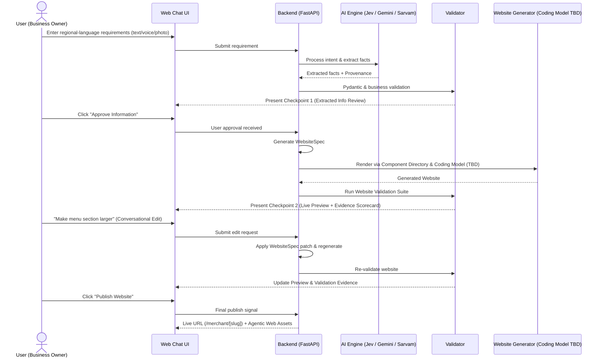

# KhojDoot — Product Requirements Document

**Version:** PRD v2.0  
**Status:** Hackathon implementation PRD  
**Target:** October 9–10, 2026  
**Problem Statement:** PS-29 — Regional-Language No-Code Website Creation Platform  
**Product:** KhojDoot  
**Document Purpose:** Define product requirements, workflows, scope, features, user experience, validation, user approval checkpoints, and acceptance criteria.

---

## 1. Product definition

KhojDoot is a **regional-language, no-code website creation and digital-presence platform**.

A non-technical business owner can describe their business and website requirements in a regional language using text, voice, or images. KhojDoot interprets the requirements, extracts structured business information, creates a website specification (`WebsiteSpec`), generates a usable website via a coding model, validates the result, and allows the user to preview and modify the website through natural-language instructions.

The product features **KhojDoot Web Chat** as its primary user interface, with an optional connection for **Meta WhatsApp Cloud API**.

The product combines two presentation layers:

```text
                    KHOJDOOT
                       │
          ┌────────────┴────────────┐
          │                         │
          ▼                         ▼
   HUMAN WEBSITE LAYER       AGENTIC WEB LAYER
          │                         │
          ▼                         ▼
    Generated Website          AgentFacts
    Editable Website           Business JSON
    Khoj Card                  JSON-LD
    Website Preview            Agent Card
    Validation Evidence        llms.txt / llms-full.txt
                               sitemap.xml / robots.txt
```

The fundamental product model is:

```text
Regional-language requirement (Web Chat)
            ↓
Requirement understanding (Intent + Extraction)
            ↓
Structured business information (InfoBin)
            ↓
Deterministic validation
            ↓
CHECKPOINT 1: User Approval / Consent
            ↓
Website specification (WebsiteSpec)
            ↓
Component-based website generation (Coding Model TBD)
            ↓
Website validation & evidence scoring
            ↓
CHECKPOINT 2: Website Preview & Natural-Language Editing
            ↓
Re-validation
            ↓
Published website
            ↓
Machine-readable agentic-web assets
```

---

## 2. Problem statement alignment

KhojDoot directly addresses the three core challenges of PS-29:

1. **Regional-Language Understanding:** Accepts inputs in regional languages (Marathi, Hindi, English, Telugu) dealing with incomplete or changing real-world merchant inputs.
2. **Code Generation & Editing:** Connects natural-language requirement interpretation and coding-model generation with an editable, component-based website output.
3. **Validation & Decision Support:** Produces usable multilingual websites with deterministic validation checks, measurable scorecards, and action recommendations.

KhojDoot's competition-facing promise:

> **KhojDoot allows a non-technical business owner to describe their business and website requirements in a regional language and receive a validated, editable website without writing code.**

---

## 3. Target users

### 3.1 Primary user — non-technical business owner
Describes business details in natural regional phrasing. Requires zero knowledge of HTML, CSS, JavaScript, domains, JSON, or SEO.

### 3.2 Secondary user — small business operator
Operates an SME with raw business assets (paper rate cards, voice notes, photos) but no digital web presence.

### 3.3 Demonstration user
Evaluates the end-to-end flow during hackathon presentation:
```text
Regional-language input (Web Chat) 
  → AI understanding 
  → InfoBin 
  → Checkpoint 1 (Approval) 
  → WebsiteSpec 
  → Generated Website 
  → Validation Evidence 
  → Checkpoint 2 (Preview & Edit) 
  → Re-validation 
  → Published Site
```

---

## 4. Product goals & scope

### P0 — Competition-critical (Hackathon MVP)
1. **Primary Web Chat Interface:** Responsive chat interface for requirement input and conversational editing.
2. **Multilingual Input:** Support for text, voice (Sarvam Saaras STT where stable), and image inputs (Gemini Image Understanding).
3. **Requirement & Intent Understanding:** Intent classification via Jev, extraction via Gemini.
4. **Canonical InfoBin:** Structured business facts validated via Pydantic rules.
5. **Checkpoint 1 (Business Info Approval):** User explicitly confirms extracted business facts before site generation.
6. **WebsiteSpec Generation:** Abstract JSON website presentation schema.
7. **Component-Based Website Generation:** Generating UI components using a bounded Component Directory and a Coding Model (TBD).
8. **Website Validation Evidence:** Measurable pass/fail validation score (structural, content, technical, mobile).
9. **Checkpoint 2 (Website Preview & Editing):** Visual site preview with natural-language editing ("Make menu larger").
10. **Re-validation & Publication:** Re-running validation post-edit and publishing to dynamic route (`/merchant/[slug]`).
11. **Agentic Web Assets:** Publishing `AgentFacts`, `JSON-LD`, `Business JSON`, `llms.txt`, `sitemap.xml`, and `robots.txt`.

### P1 — Strong differentiators
1. Optional WhatsApp Cloud API secondary input.
2. Design directions (minimal, editorial, traditional, premium).
3. KhojDoot Labs telemetry dashboard & validation metrics.
4. Field-level provenance tracking.
5. Lightweight consent ledger.

### P2 — Future capabilities
1. Ordering & payments (MCP / A2A protocols).
2. Advanced multi-tenant cloud infrastructure.
3. Screenshot-based site editing.

---

## 5. Core product checkpoints & workflows

### 5.1 Checkpoint 1: Business Information Approval / Consent
Before website code is generated, the extracted business facts must be presented to the user in Web Chat for explicit review.
- **Purpose:** Prevent AI hallucinations from corrupting published business facts.
- **Action:** User clicks "Approve Information" or specifies text corrections.
- **Outcome:** Generates a consent/approval record and unlocks `WebsiteSpec` generation.

### 5.2 Checkpoint 2: Website Preview & Natural-Language Editing
After the coding model generates the website and validation runs, the user is presented with a live visual preview.
- **Purpose:** Allow visual inspection and conversational tweaking.
- **Action:** User provides feedback ("Remove testimonials", "Move contact to top").
- **Outcome:** Applies `WebsiteSpec` patch, triggers re-validation, and updates preview.

---

## 6. Input specifications

### 6.1 Text Input (Primary)
User enters business requirements via Web Chat input box in Marathi, Hindi, or English.

### 6.2 Voice Input
User records audio notes in Web Chat; transcribed to text via Sarvam Saaras (`mr-IN`).

### 6.3 Image Input
User uploads menu photos or shop signs; structured data extracted via Gemini Image Understanding.

---

## 7. User experience & journey



---

## 8. Definition of done for hackathon MVP

The KhojDoot prototype is complete when:
1. A merchant describes business requirements in a regional language via **KhojDoot Web Chat**.
2. Requirements are classified (Jev) and extracted (Gemini + Image Understanding) into **InfoBin**.
3. Merchant completes **Checkpoint 1** (explicit info approval).
4. **WebsiteSpec** is created and rendered via **Component Directory** & **Coding Model (TBD)**.
5. **Website Validation** executes and displays a measurable score (e.g., `8/8 checks passed`).
6. Merchant completes **Checkpoint 2** (previews site and performs at least 1 natural-language edit).
7. Re-validation passes and the site is published to a dynamic route (`/merchant/[slug]`).
8. Machine-readable assets (`AgentFacts`, `Business JSON`, `JSON-LD`, `llms.txt`, `sitemap.xml`) are generated.
