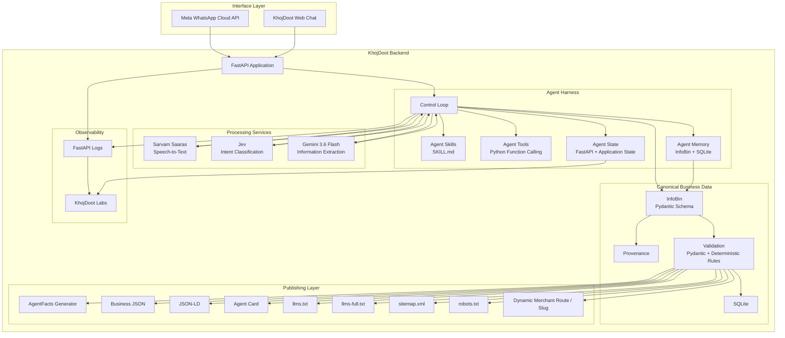

# KhojDoot Technical PRD

Version: Working PRD v1.0  
Purpose: Hackathon prototype  
Primary implementation target: October 9–10 demo  

This PRD consolidates the architecture, technical specification, happy path, component responsibilities, and implementation decisions discussed so far.

It is intentionally written as an implementation document. It does not introduce new product features.

---

# 1. Product definition

KhojDoot is a multilingual merchant onboarding and publishing system.

A merchant can provide business information through WhatsApp or the KhojDoot web interface.

The system processes the information using an agent-based backend.

The backend creates canonical structured business information.

The merchant confirms the information.

The approved information is published as a Khoj Card and as machine-readable web assets.

The system therefore creates a crawlable merchant presence for the agentic web.

The core product is:

```text
Merchant
    ↓
Onboarding
    ↓
Structured business information
    ↓
Merchant approval
    ↓
AgentFacts
    ↓
Crawlable web assets
    ↓
Khoj Card
```

Ordering is a later phase.

Ordering must not block the core onboarding and publishing flow.

---

# 2. Problem

Small businesses often have useful information but do not have a structured digital presence that can be consumed easily by web systems and AI agents.

The merchant may provide information through natural conversation.

KhojDoot converts this information into structured business information.

The system then publishes this information in formats that can be consumed by humans, crawlers, and agentic systems.

---

# 3. Product goals

The prototype must demonstrate these capabilities:

1. Merchant onboarding.
2. Multilingual text input.
3. Voice input.
4. Image input.
5. Speech-to-text.
6. Intent classification.
7. Business information extraction.
8. Agent Skills.
9. Agent tools.
10. Agent state.
11. Agent memory.
12. Agent harness.
13. InfoBin.
14. Provenance.
15. Deterministic validation.
16. Merchant confirmation.
17. AgentFacts generation.
18. Business JSON.
19. JSON-LD.
20. Agent Card.
21. `llms.txt`.
22. `llms-full.txt`, where supported by the selected implementation.
23. `sitemap.xml`.
24. `robots.txt`.
25. Dynamic merchant route.
26. Khoj Card.
27. Basic observability.
28. A foundation for later ordering.

---

# 4. Non-goals for the first prototype

The following must not block the core demo:

* Full production ordering system.
* Full payment implementation.
* Complex external agent-to-agent ecosystem.
* Production-scale database infrastructure.
* Large-scale merchant onboarding.
* Advanced analytics.
* Complex discovery ranking.
* Separate deployment for every merchant.

MCP and A2A remain part of the architecture for later action and interoperability work.

---

# 5. Core product phases

## Phase 1: Discovery

The system creates the merchant's structured digital presence.

```text
Merchant
   ↓
Onboarding
   ↓
Input processing
   ↓
Intent
   ↓
Information extraction
   ↓
Agent processing
   ↓
InfoBin
   ↓
Validation
   ↓
Merchant approval
   ↓
Published merchant information
```

## Phase 2: Interface

The approved information becomes accessible through human and machine-readable interfaces.

```text
Approved information
        ↓
   ┌────┴────┐
   ↓         ↓
Khoj Card   Machine-readable assets
             ↓
       JSON / JSON-LD
       AgentFacts
       Agent Card
       llms.txt
       llms-full.txt
       sitemap.xml
       robots.txt
```

## Phase 3: Actions / Ordering

The system can later support actions on top of the merchant information.

```text
User / Agent request
        ↓
Intent
        ↓
Business action
        ↓
Ordering workflow
        ↓
MCP / A2A / Payment
```

---

# 6. Primary happy path

The primary prototype path is:

```text
Merchant
   ↓
WhatsApp
   ↓
Meta WhatsApp Cloud API
   ↓
FastAPI
   ↓
Agent Harness
   ↓
Sarvam / Jev / Gemini
   ↓
InfoBin
   ↓
Validation
   ↓
Merchant confirmation
   ↓
AgentFacts
   ↓
Crawlable assets
   ↓
Khoj Card
   ↓
Dynamic merchant URL
```

The Web Chat interface uses the same backend.

```text
Web Chat
   ↓
FastAPI
   ↓
Same Agent Harness
   ↓
Same InfoBin
   ↓
Same publishing system
```

There must not be two separate business-processing systems.

---

# 7. Input specification

The system supports three primary input types.

### Text

```text
Merchant text
    ↓
FastAPI
    ↓
Agent processing
```

### Voice

```text
Voice message
    ↓
Sarvam Saaras (mr-IN)
    ↓
Text
    ↓
Agent processing
```

### Image

```text
Image
    ↓
Gemini 3.6 Flash
    ↓
Extracted information
    ↓
Agent processing
```

The system should normalize these inputs before the main merchant-information process.

---

# 8. Agent architecture

The agent is not only an LLM call.

The agent consists of:

```text
Agent Harness
│
├── Model
├── Skills
├── Tools
├── State
├── Memory
├── Control Loop
└── Validation
```

## 8.1 Agent Skills

Agent Skills define onboarding rules and procedures.

Technology:

```text
SKILL.md / Agent Skills
```

Skills should define what the agent needs to do during merchant onboarding.

---

## 8.2 Agent Tools

The agent uses controlled Python functions for operations.

Examples include:

```text
Create merchant
Update merchant
Read merchant
Store information
Validate information
Publish information
```

The final function names are implementation details.

The important requirement is that the agent does not directly manipulate application resources without controlled functions.

---

## 8.3 Agent State

Agent state maintains the current onboarding process.

FastAPI and application state manage the active state.

Examples of state include:

```text
Current merchant
Current onboarding step
Pending information
Confirmation status
Current interaction
```

The exact state structure will be defined during implementation.

---

## 8.4 Agent Memory

Agent memory separates temporary conversation context from persistent business information.

The proposed model is:

```text
Current context
       +
Persistent business information
```

The persistent business information is stored through:

```text
InfoBin + SQLite
```

The memory approach is inspired by the MemGPT model discussed for the project.

The system must not treat temporary conversation context as the canonical merchant record.

---

## 8.5 Agent Harness

The Agent Harness combines:

```text
Model
+
Skills
+
Tools
+
State
+
Memory
+
Control loop
```

It is the main execution layer for the onboarding agent.

---

# 9. Intent classification

Jev is used for intent classification.

Its responsibility is to determine:

* What the merchant is trying to do.
* What information is missing.
* What the next onboarding action should be.

Jev should not become a dependency for every backend operation.

The implementation must keep the intent layer replaceable.

---

# 10. Information extraction

Gemini 3.6 Flash is used for information extraction.

Its responsibility is to extract business facts from:

* Text.
* Transcribed voice.
* Photos.

The result must be structured.

The output must conform to the InfoBin schema.

The AI must not directly publish arbitrary output.

---

# 11. InfoBin

InfoBin is the canonical structured representation of merchant information.

Conceptually:

```text
Input
  ↓
Extraction
  ↓
InfoBin
```

InfoBin should contain the approved business information required by the KhojDoot system.

The implementation uses:

```text
Pydantic
+
SQLite
```

Pydantic provides schema validation.

SQLite provides persistent storage for the prototype.

---

# 12. Provenance

The system must preserve information about where extracted information came from.

Provenance should capture information such as:

```text
Source
Channel
Extraction
Approval
```

For example:

```text
Source:
Merchant voice message

Channel:
WhatsApp

Extraction:
Gemini

Approval:
Merchant confirmed
```

The exact database fields are implementation details and must be defined before coding.

---

# 13. Validation

Validation is a mandatory backend step.

The system must prevent:

* Missing required information.
* Invalid information.
* Unapproved information.
* AI-generated information from being published as confirmed merchant information.

The architecture is:

```text
AI output
   ↓
Pydantic validation
   ↓
Deterministic validation
   ↓
Merchant confirmation
   ↓
Publish
```

AI output is not automatically trusted.

---

# 14. Merchant approval

The merchant must confirm the information before publication.

The planned confirmation mechanism is:

```text
KhojDoot
   ↓
Merchant receives summary
   ↓
Merchant replies YES
   ↓
Information becomes approved
   ↓
Publishing starts
```

The approval state must be stored.

---

# 15. AgentFacts

AgentFacts is a first-class backend component.

It must not be treated as a simple frontend file.

The pipeline is:

```text
Approved InfoBin
       ↓
AgentFacts generator
       ↓
AgentFacts artifact
       ↓
Validation
       ↓
Publication
```

The AgentFacts implementation will use the specific repository provided by the project team.

The repository must be treated as the implementation source of truth for:

* Schema.
* Required fields.
* Generator.
* Validation.
* Output format.
* Repository-specific conventions.

We must not invent AgentFacts fields.

---

# 16. Crawlable assets

Crawlable assets are a major product output.

The backend or publishing system must generate the required machine-readable assets.

The planned assets include:

```text
AgentFacts
Business JSON
JSON-LD
Agent Card
llms.txt
llms-full.txt
sitemap.xml
robots.txt
```

These assets provide structured information about published businesses.

The architecture is:

```text
Approved InfoBin
      ↓
Asset Generation
      ↓
┌─────────────────────┐
│ AgentFacts          │
│ Business JSON       │
│ JSON-LD             │
│ Agent Card          │
│ llms.txt            │
│ llms-full.txt       │
│ sitemap.xml         │
│ robots.txt          │
└─────────────────────┘
```

The exact file paths and AgentFacts-specific format must follow the selected repositories/specifications.

---

# 17. Dynamic business route

Each merchant receives a dynamic route.

Example:

```text
/merchant/ganesh-foods
```

The slug is only an identifier for the route.

It is not the core discovery mechanism.

The primary value is the published structured information and crawlable assets.

The system uses one reusable route.

It does not deploy a separate application for every merchant.

---

# 18. Khoj Card

The Khoj Card displays approved merchant information.

Technology:

```text
Next.js / Server Templates
Tailwind CSS
```

The page reads the merchant's approved information.

The page can expose:

```text
Human-readable business information
Business JSON
JSON-LD
AgentFacts
Other crawlable assets
```

The exact presentation belongs to the frontend implementation.

---

# 19. Agent Card

The Agent Card describes KhojDoot's agent capabilities and interface.

Planned location:

```text
/.well-known/agent-card.json
```

The exact contents must follow the selected implementation/specification.

This is separate from the merchant's business information.

Conceptually:

```text
KhojDoot Agent
      ↓
Agent Card

Merchant
      ↓
Merchant AgentFacts / business assets
```

---

# 20. `llms.txt`

KhojDoot will publish machine-readable site context through:

```text
/llms.txt
```

The project also discussed:

```text
/llms-full.txt
```

These should be generated from the approved published information and site structure.

They should not contain information that has not been approved for publication.

---

# 21. Sitemap

The system generates:

```text
/sitemap.xml
```

The sitemap lists published merchant URLs.

Conceptually:

```text
Published merchants
       ↓
Sitemap generator
       ↓
sitemap.xml
```

Only published merchant pages should be included.

---

# 22. Robots

The system generates:

```text
/robots.txt
```

It defines crawler access for the public web application.

The exact crawler rules will be defined during deployment.

---

# 23. Observability

The system needs basic observability for the hackathon.

The purpose is to understand what the agent is doing.

The planned sources are:

```text
FastAPI logs
+
Frontend state
```

The system should make it possible to inspect:

```text
Model calls
Tool calls
State transitions
Generated information
Validation results
Publishing status
```

This supports the KhojDoot Labs interface.

---

# 24. KhojDoot Labs

KhojDoot Labs is a demonstration interface.

It can show the live processing state to the jury.

Technology:

```text
Next.js / Server Templates
```

It can expose:

```text
Agent state
InfoBin state
Tool activity
Model activity
Generated outputs
```

It is a demonstration and observability interface.

It must not become a dependency for the core merchant onboarding flow.

---

# 25. Ordering architecture

Ordering is Phase 3.

The architecture is:

```text
User / Agent
     ↓
Action intent
     ↓
Jev + Gemini
     ↓
Business action
     ↓
Python function
     ↓
Business state
     ↓
Ordering workflow
```

MCP can standardize tool/resource access when required.

A2A can support agent-to-agent communication when required.

Payment infrastructure can be added when the ordering flow requires it.

None of these components should block Phase 1.

---

# 26. High-level backend architecture



This is the backend-oriented architecture.

It intentionally does not treat the database as the center of the system.

The **Agent Harness is the central execution layer**.

The **InfoBin is the canonical business-information layer**.

The **AgentFacts and crawlable-assets layer is the publication layer**.

The **slug is a secondary routing mechanism**.

---

# 27. Technical stack

| Area                              | Technology                              |
| --------------------------------- | --------------------------------------- |
| Backend language                  | Python                                  |
| Backend framework                 | FastAPI                                 |
| Local server                      | Uvicorn                                 |
| WhatsApp                          | Meta WhatsApp Cloud API                 |
| Speech-to-text                    | Sarvam Saaras (mr-IN)                   |
| Intent classification             | Jev                                     |
| Information extraction            | Gemini 3.6 Flash                        |
| Agent Skills                      | SKILL.md / Agent Skills                 |
| Agent tools                       | Python function calling                 |
| Agent state                       | FastAPI + application state             |
| Agent memory                      | InfoBin + SQLite                        |
| Agent harness                     | Custom Python agent loop                |
| Structured schema                 | Pydantic                                |
| Database                          | SQLite                                  |
| Business data                     | InfoBin                                 |
| Provenance                        | InfoBin metadata                        |
| Validation                        | Pydantic + deterministic validation     |
| Web interface                     | Next.js / HTML Templates                |
| UI styling                        | Tailwind CSS                            |
| Business route                    | Dynamic merchant route                  |
| Business JSON                     | JSON                                    |
| Semantic business data            | Schema.org + JSON-LD                    |
| Agent description                 | `/.well-known/agent-card.json`          |
| Machine-readable context          | `llms.txt`                              |
| Extended machine-readable context | `llms-full.txt`                         |
| Crawl index                       | `sitemap.xml`                           |
| Crawler rules                     | `robots.txt`                            |
| Observability                     | FastAPI logs + frontend state           |
| Ordering tools                    | Python function calling                 |
| Tool/resource protocol            | MCP                                     |
| Agent-to-agent communication      | A2A                                     |
| Payment                           | Relevant payment / agentic-commerce API |

---

# 28. System boundaries

The following boundaries are important.

### Backend owns

* FastAPI.
* WhatsApp webhook.
* Agent Harness.
* Agent Skills.
* Agent Tools.
* Agent State.
* Agent Memory.
* AI integrations.
* InfoBin.
* Provenance.
* Validation.
* Merchant approval state.
* AgentFacts generation.
* Crawlable asset generation.
* Business JSON.
* JSON-LD.
* Agent Card.
* Sitemap generation.
* Backend logs.

### Frontend owns

* Web Chat.
* Khoj Card.
* KhojDoot Labs.
* Frontend state display.
* Visual presentation.

### Deployment owns

* Running the backend publicly.
* HTTPS.
* Stable public endpoint.
* Running the frontend publicly.

Railway is a possible backend deployment option.

It is not a required application component.

---

# 29. Team responsibility

| Person       | Primary ownership                                                      |
| ------------ | ---------------------------------------------------------------------- |
| **Ankur**    | Architecture, contracts, integration, system testing, final demo path  |
| **Abhishek** | FastAPI backend, webhook, API integration, backend runtime             |
| **Shantanu** | SQLite, InfoBin persistence, database functions                        |
| **Gayatri**  | Web Chat, Khoj Card, dynamic merchant route, frontend                  |
| **Paksha**   | Sarvam, Jev, Gemini, extraction and AI processing                      |
| **Sakshi**   | QA, multilingual test cases, demo data, validation, end-to-end testing |

AgentFacts and crawlable asset generation should be assigned explicitly during implementation rather than being left ownerless. The implementation owner must work from the actual AgentFacts repository and specification.

---

# 30. Implementation order

The team should not build every component simultaneously.

The implementation order is:

```text
1. FastAPI runs locally
        ↓
2. Basic API works
        ↓
3. SQLite connection works
        ↓
4. InfoBin schema works
        ↓
5. Merchant create/update works
        ↓
6. Agent Harness works
        ↓
7. Agent Skills work
        ↓
8. Agent Tools work
        ↓
9. Agent State works
        ↓
10. Agent Memory works
        ↓
11. Gemini extraction works
        ↓
12. Jev intent layer works
        ↓
13. Sarvam voice path works
        ↓
14. Validation works
        ↓
15. Merchant approval works
        ↓
16. AgentFacts generation works
        ↓
17. Crawlable assets work
        ↓
18. Khoj Card reads approved data
        ↓
19. WhatsApp webhook works
        ↓
20. Public backend deployment works
        ↓
21. Complete end-to-end test
```

This order is deliberately incremental.

At each stage, the team should have something that can be tested.

---

# 31. Definition of done for the core prototype

The core prototype is complete when a real merchant can:

```text
Send information
      ↓
WhatsApp / Web Chat
      ↓
KhojDoot receives it
      ↓
AI processes it
      ↓
InfoBin is created
      ↓
Information is validated
      ↓
Merchant confirms
      ↓
AgentFacts is generated
      ↓
Crawlable assets are generated
      ↓
Merchant page is published
      ↓
Khoj Card is accessible
```

The system must demonstrate this without manual database editing during the demo.

---

# 32. Critical engineering rule

The project should be built as connected modules, not as one large implementation.

The key interfaces are:

```text
Input
  ↓
Agent Harness
  ↓
Structured Information
  ↓
InfoBin
  ↓
Validation
  ↓
Publication
```

Each boundary must have a fixed contract.

If a component is not ready, another team member should be able to develop against the agreed contract using mock data.

This is especially important because the current repository contains existing work from different branches with known differences in backend and database contracts.

Those contracts must be reconciled before integration.

---

# 33. Current priority

The immediate priority is not to build the entire architecture.

The immediate priority is:

```text
FastAPI
   ↓
one working endpoint
   ↓
SQLite
   ↓
InfoBin
   ↓
one merchant
```

After that, add the agent loop.

Then add AI.

Then add publishing.

Then add WhatsApp.

Then deploy.

This gives you a progressive implementation path from a single Python file to the complete KhojDoot system.
