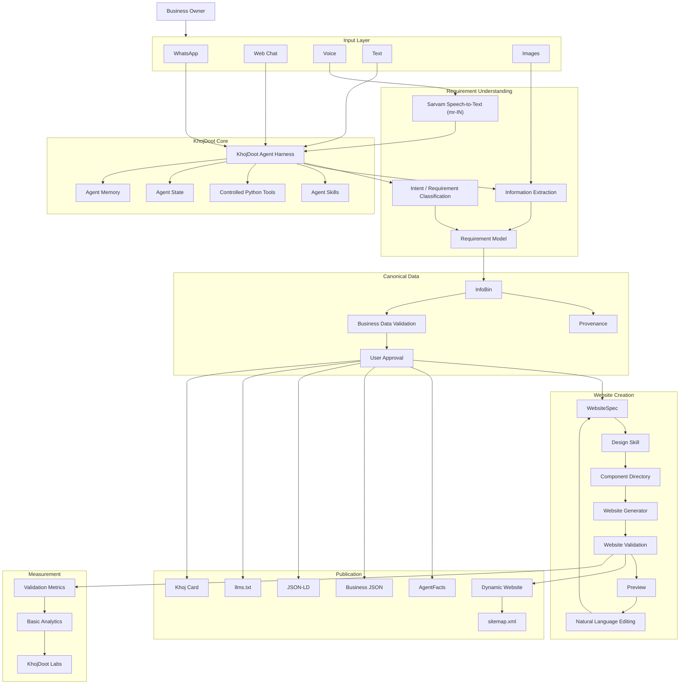
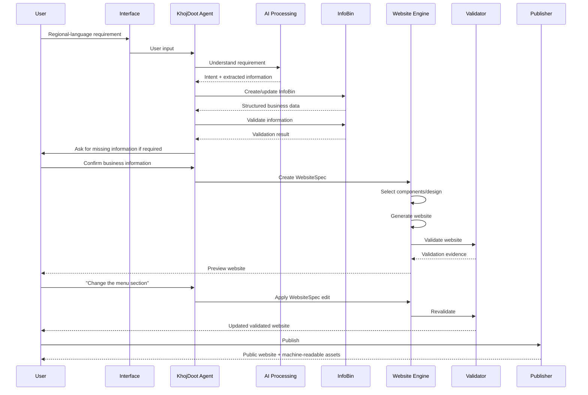
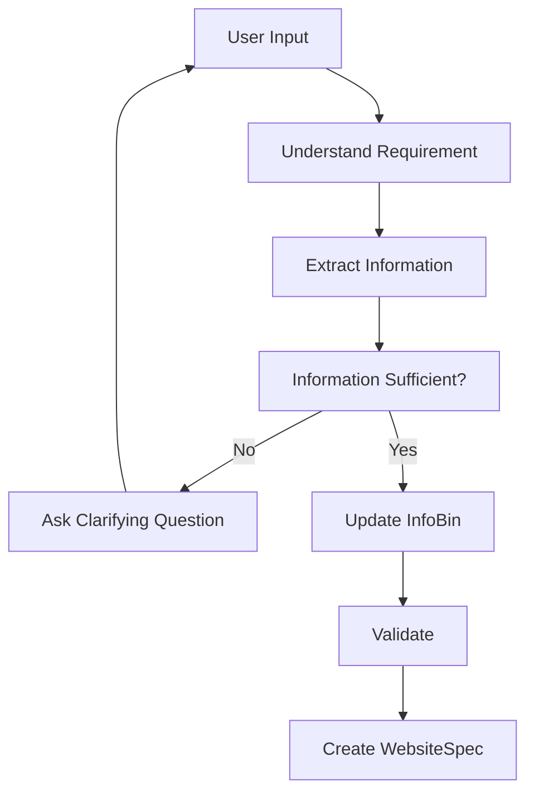
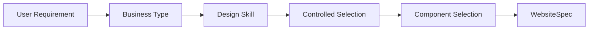
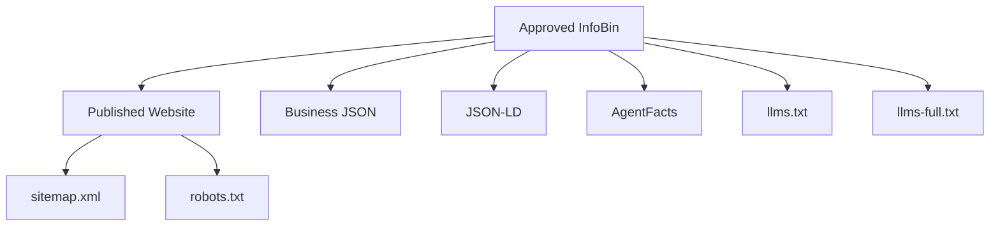
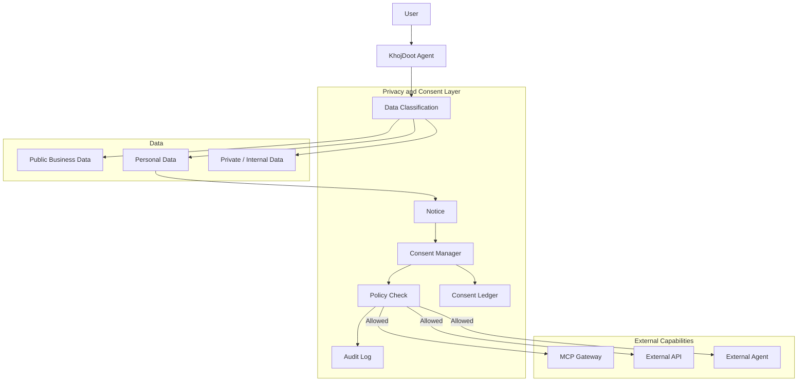
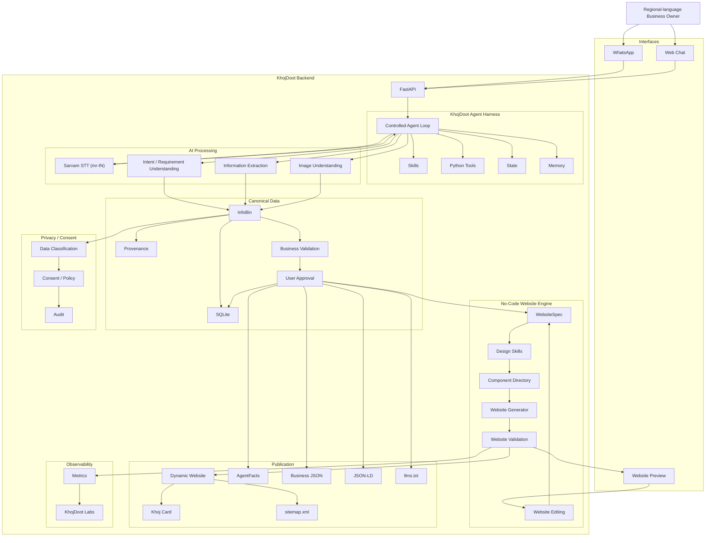

# KhojDoot — Product Requirements Document

**Version:** PRD v2.0  
**Status:** Hackathon implementation PRD  
**Target:** October 9–10, 2026  
**Problem Statement:** PS-29 — Regional-Language No-Code Website Creation Platform  
**Product:** KhojDoot  
**Document Purpose:** Define what KhojDoot must achieve, how the major product capabilities fit together, what is in scope for the hackathon, and how success will be demonstrated.

This PRD supersedes the earlier merchant-onboarding-only PRD. The earlier PRD remains useful for the existing backend implementation, but it is no longer sufficient as the complete product definition because the competition problem statement explicitly requires website creation, editing, validation, decision support, and measurable results.

---

## 1. Product definition

KhojDoot is a **regional-language, no-code website creation and digital-presence platform**.

A non-technical business owner can describe their business in a regional language using text, voice, and images. KhojDoot understands the requirements, extracts structured business information, creates a website specification, generates a usable website, validates the result, and allows the user to modify the website through natural-language instructions.

The same structured information can also be published as machine-readable business information for the agentic web.

The product therefore combines two layers:

```text
                    KHOJDOOT
                       │
          ┌────────────┴────────────┐
          │                         │
          ▼                         ▼
   HUMAN WEBSITE LAYER       AGENTIC WEB LAYER
          │                         │
          ▼                         ▼
    Generated Website          AgentFacts
    Editable Website           Business JSON
    Khoj Card                  JSON-LD
    Preview                    Agent Card
    Validation                 llms.txt
                               sitemap.xml
```

The fundamental product model is:

```text
Natural-language requirement
            ↓
Requirement understanding
            ↓
Structured business information
            ↓
Website specification
            ↓
Website generation
            ↓
Validation
            ↓
User approval / editing
            ↓
Published website
            ↓
Machine-readable business presence
```

This extends the original KhojDoot flow:

```text
Merchant
 ↓
WhatsApp / Web Chat
 ↓
AI processing
 ↓
InfoBin
 ↓
Validation
 ↓
Approval
 ↓
AgentFacts
 ↓
Khoj Card
```

into the complete competition flow:

```text
User
 ↓
Regional-language requirement
 ↓
AI understanding
 ↓
InfoBin
 ↓
WebsiteSpec
 ↓
Website generation
 ↓
Validation
 ↓
Editable preview
 ↓
User approval
 ↓
Published website
 ↓
Agentic-web assets
```

The original architecture already defines Agent Harness as the execution layer, InfoBin as the canonical business-information layer, and AgentFacts/crawlable assets as the publication layer. The new PRD adds WebsiteSpec and the website-generation/validation loop between InfoBin and publication.

---

# 2. Problem statement alignment

The competition problem statement describes three major challenges:

1. Understand website requirements expressed in regional languages and deal with incomplete or changing real-world inputs.
2. Connect natural-language requirement interpretation and code generation with editable website output and validation.
3. Produce usable multilingual websites while handling language ambiguity and generated-code correctness, with measurable validation evidence.

The expected outcome explicitly includes:

- a working regional-language no-code website creation platform;
- natural-language interpretation and code generation;
- editable website output;
- validation;
- decision support;
- usable multilingual websites;
- dashboard/alerting;
- performance and result analysis;
- final technical demonstration.

Therefore, KhojDoot must not present itself only as a merchant onboarding system.

Its competition-facing product definition is:

> **KhojDoot allows a non-technical business owner to describe their business and website requirements in a regional language and receive a validated, editable website without writing code.**

Merchant discovery and agentic-web publication remain important differentiators, but they support the main website-creation requirement rather than replacing it.

---

# 3. Target users

## 3.1 Primary user — non-technical business owner

Example:

```text
Merchant:
"माझं एक मिसळचं दुकान आहे.
नाशिकमध्ये आहे.
मला माझ्या दुकानासाठी एक साधी website पाहिजे.
Menu, location आणि WhatsApp contact दाखवा."
```

The user does not need to know:

- HTML;
- CSS;
- JavaScript;
- React;
- domains;
- JSON;
- APIs;
- website hosting;
- SEO;
- structured data.

KhojDoot translates the user's intent into a structured website.

## 3.2 Secondary user — small business operator

The operator may already have business information but no website.

Inputs may include:

- text;
- voice;
- photographs;
- menu images;
- product images;
- location information;
- contact information;
- business descriptions.

## 3.3 Demonstration user

For the hackathon, the team will use a representative local business scenario.

The demonstration should show:

```text
Regional-language input
        ↓
AI interpretation
        ↓
Website generated
        ↓
Validation
        ↓
User edits
        ↓
Updated website
```

---

# 4. Product goals

The hackathon prototype must demonstrate the following.

### P0 — Competition-critical

1. Regional-language input.
2. Text input.
3. Voice input where technically stable.
4. Business information extraction.
5. Requirement interpretation.
6. Canonical structured business data.
7. Website specification generation.
8. Component-based website generation.
9. Website preview.
10. Website validation.
11. Natural-language website editing.
12. Regeneration/update after editing.
13. Multilingual website content.
14. Published dynamic website.
15. Basic measurable validation evidence.
16. Basic analytics/metrics.
17. Machine-readable business information.
18. End-to-end working demonstration.

### P1 — Strong differentiators

1. Image understanding.
2. Multiple design directions.
3. Design skills.
4. Controlled design variation.
5. Conversational editing.
6. Visual/component editing.
7. Khoj Card.
8. AgentFacts.
9. JSON-LD.
10. `llms.txt`.
11. `sitemap.xml`.
12. Validation dashboard.
13. Generation-quality metrics.
14. Consent/privacy controls.

### P2 — Future architecture

1. Ordering.
2. Payments.
3. MCP-based external capabilities.
4. A2A agent interaction.
5. Advanced discovery.
6. Advanced analytics.
7. Screenshot/reference-based website editing.
8. Large-scale merchant deployment.
9. Production-grade multi-tenant infrastructure.

The original PRD already explicitly placed ordering, payment, complex A2A ecosystems, advanced analytics, and production-scale infrastructure outside the first prototype. That boundary remains valid.

---

# 5. Product principles

## 5.1 No-code for the user

The user should not need to write code.

Internally, the system may generate code, but code is an implementation detail.

```text
User
 ↓
Natural language
 ↓
KhojDoot
 ↓
Website
```

Not:

```text
User
 ↓
Prompt
 ↓
Code editor
 ↓
Debugging
 ↓
Website
```

## 5.2 Structured information before generation

The system should not directly convert an arbitrary user message into uncontrolled website code.

Instead:

```text
User input
 ↓
Understanding
 ↓
Structured information
 ↓
Website specification
 ↓
Generation
```

This provides an intermediate representation that can be validated.

## 5.3 The LLM should not control the entire system

The AI model should interpret and generate structured outputs.

Deterministic application code should control:

- validation;
- state transitions;
- persistence;
- publication;
- permissions;
- allowed website components.

## 5.4 Edit the specification, not the entire website

A user request such as:

> "Make the menu section larger and add three products."

should become a structured website change.

Conceptually:

```text
User edit
 ↓
Edit interpretation
 ↓
WebsiteSpec patch
 ↓
Deterministic validation
 ↓
Website update
```

This is preferable to regenerating an unrelated website from scratch.

## 5.5 Approved information is the source of truth

All public representations should originate from approved structured information.

```text
Approved InfoBin
       │
       ├── Website
       ├── Khoj Card
       ├── AgentFacts
       ├── JSON-LD
       ├── Business JSON
       └── Machine-readable assets
```

The existing TRD explicitly requires published assets to use the same approved source so that different representations do not contain conflicting merchant information.

---

# 6. Core product architecture

The new product architecture is:



---

# 7. Core conceptual model

KhojDoot has four important representations.

## 7.1 Requirement

What the user wants.

Example:

```text
"I need a website for my bakery.
Show cakes, address, WhatsApp number and opening hours."
```

## 7.2 InfoBin

What is known about the business.

Example:

```json
{
  "business_name": "ABC Bakery",
  "category": "Bakery",
  "location": "...",
  "phone": "...",
  "opening_hours": "...",
  "products": [...]
}
```

InfoBin is the canonical business-information representation.

## 7.3 WebsiteSpec

How the information should be presented.

Conceptually:

```json
{
  "theme": "minimal",
  "sections": [
    {
      "type": "hero"
    },
    {
      "type": "products"
    },
    {
      "type": "about"
    },
    {
      "type": "location"
    },
    {
      "type": "contact"
    }
  ]
}
```

WebsiteSpec is the intermediate representation between business information and generated UI.

## 7.4 Website

The final human-facing presentation.

```text
InfoBin
   ↓
WebsiteSpec
   ↓
Website
```

The distinction is important:

```text
InfoBin       = What is true?
WebsiteSpec   = How should it be presented?
Website        = Rendered result
```

---

# 8. User journey

The primary user journey is:



---

# 9. Input requirements

KhojDoot supports three primary input modes.

## 9.1 Text

The user can provide requirements directly.

Example:

```text
"Create a website for my restaurant.
It is in Nashik.
We serve misal, pav bhaji and tea.
Show location and WhatsApp contact."
```

The system extracts:

- business type;
- business name;
- location;
- products/services;
- contact information;
- desired sections;
- other website requirements.

## 9.2 Voice

The user can speak naturally in a supported regional language.

```text
Voice
 ↓
Speech-to-text (Sarvam Saaras mr-IN)
 ↓
Text
 ↓
Requirement understanding
```

The existing architecture uses Sarvam Saaras for the speech-to-text stage.

Voice should be treated as an input modality, not as a separate product workflow.

## 9.3 Images

The user may provide:

- menu photographs;
- product photographs;
- shop photographs;
- logos;
- business documents containing useful information.

The image processing system extracts useful information and associates it with provenance.

Image processing should not automatically publish unverified information.

---

# 10. Multilingual requirement understanding

The system must accept regional-language requirements.

The architecture should separate:

```text
Language understanding
        ↓
Semantic requirement
        ↓
Structured representation
```

The website can then use the user's selected language for content generation.

The language itself must not change the underlying business-information model.

For example:

```text
Marathi input
      ↓
same InfoBin schema
      ↓
Marathi website

Telugu input
      ↓
same InfoBin schema
      ↓
Telugu website

English input
      ↓
same InfoBin schema
      ↓
English website
```

This allows language to remain an interface property rather than creating different backend schemas for different languages.

---

# 11. Handling ambiguity and incomplete information

The competition problem specifically requires handling incomplete and changing real-world inputs.

KhojDoot should not guess critical business information when it is missing.

Example:

```text
User:
"Create a website for my restaurant."

System:
"What is the restaurant name?"

User:
"Shree Ganesh."

System:
"What would you like to show on the website?"

User:
"Menu and location."

System:
"Please provide your menu or menu photo."
```

The agent therefore operates as a controlled loop:



The system should distinguish:

```text
Known
Unknown
Inferred
User-confirmed
```

This also supports provenance.

---

# 12. Agent architecture

The project will use the existing custom Agent Harness rather than introducing a new agent framework immediately before the hackathon.

The architecture is intentionally a **single controlled KhojDoot agent**, not a collection of autonomous agents.

```text
KhojDoot Agent
│
├── Intent / Requirement Tool
├── Extraction Tool
├── InfoBin Tool
├── Validation Tool
├── Website Planning Tool
├── Website Generation Tool
├── Website Editing Tool
└── Publishing Tool
```

The control loop is:

```text
Receive input
 ↓
Load state
 ↓
Load relevant memory
 ↓
Understand intent
 ↓
Select required skill/tool
 ↓
Execute tool
 ↓
Update state
 ↓
Update InfoBin
 ↓
Validate
 ↓
Ask user if required
 ↓
Continue workflow
```

This preserves the architecture already defined in the TRD, where the control loop remains under application control and the model does not directly control database access.

---

# 13. Agent Skills

Skills define controlled procedures.

Examples:

```text
skills/
├── onboarding/
├── requirement-understanding/
├── business-extraction/
├── website-planning/
├── frontend-design/
├── website-generation/
├── website-validation/
├── website-editing/
└── publishing/
```

A skill should define:

- purpose;
- inputs;
- expected output;
- constraints;
- tools;
- validation rules.

The existing project already uses `SKILL.md` as the planned representation for agent skills.

---

# 14. InfoBin

InfoBin is the canonical business-information layer.

It should contain structured information such as:

```text
Business identity
Business category
Description
Products
Services
Prices
Opening hours
Location
Contact
Social links
Images
Languages
Provenance
Confidence
Approval state
```

The exact schema should remain centralized.

AI components must not independently create competing database schemas.

The existing TRD explicitly establishes InfoBin as the central structured-information contract and requires AI output to conform to the agreed schema.

---

# 15. Provenance

Information should retain its source where practical.

Example:

```json
{
  "field": "opening_hours",
  "value": "10:00 AM - 9:00 PM",
  "source": "merchant_message",
  "confidence": 1.0,
  "confirmed": true
}
```

Possible source types:

```text
USER_TEXT
USER_VOICE
USER_IMAGE
AI_INFERENCE
IMPORTED_DATA
```

Critical information inferred by AI should not be treated as user-confirmed until confirmed where appropriate.

---

# 16. Business validation

Business information must pass deterministic validation before publication.

Examples:

```text
Required fields present
Phone format valid
URL format valid
Opening-hours structure valid
Product structure valid
Location structure valid
No invalid field types
```

The architecture should use:

```text
Pydantic
+
deterministic application rules
```

rather than relying entirely on an LLM to decide whether data is valid.

This preserves the existing validation architecture.

---

# 17. WebsiteSpec

WebsiteSpec is the central addition required by the new PRD.

It defines the website independently from the implementation technology.

Example:

```json
{
  "site": {
    "language": "mr-IN",
    "business_type": "restaurant"
  },
  "theme": {
    "style": "minimal",
    "density": "comfortable"
  },
  "sections": [
    {
      "id": "hero",
      "type": "hero"
    },
    {
      "id": "menu",
      "type": "products"
    },
    {
      "id": "about",
      "type": "about"
    },
    {
      "id": "location",
      "type": "location"
    },
    {
      "id": "contact",
      "type": "contact"
    }
  ]
}
```

The WebsiteSpec must be:

- structured;
- versionable;
- editable;
- validatable;
- renderable;
- independent of the LLM provider.

---

# 18. Component Directory

Website generation should use a bounded component directory instead of allowing an LLM to invent arbitrary frontend architecture for every generation.

Example:

```text
components/
├── hero
├── about
├── services
├── products
├── gallery
├── testimonials
├── pricing
├── faq
├── location
├── contact
└── footer
```

Each component has a known interface.

Conceptually:

```text
Component
 ├── name
 ├── purpose
 ├── required data
 ├── optional data
 ├── supported variants
 └── rendering rules
```

This reduces generated-code variability and makes validation easier.

---

# 19. Design system

The system should support a small set of controlled design directions.

Example:

```text
frontend-design
minimal
editorial
traditional
premium
```

Design selection should be controlled rather than completely random.



If time is limited, one strong design system with two clearly different visual directions is preferable to many unfinished themes.

---

# 20. Website generation

The website generator converts:

```text
WebsiteSpec
      ↓
Component tree
      ↓
Generated implementation
      ↓
Rendered website
```

The generation system may use an LLM for implementation assistance, but the LLM must operate inside a bounded environment.

The model should not be responsible for:

- selecting arbitrary infrastructure;
- creating database schemas;
- changing backend architecture;
- bypassing validation;
- publishing directly.

The coding model is an implementation layer.

---

# 21. Deterministic rendering preference

Where practical:

```text
WebsiteSpec
 ↓
Known components
 ↓
Deterministic renderer
 ↓
Website
```

is preferred over:

```text
WebsiteSpec
 ↓
LLM
 ↓
completely new website code
```

The second approach increases:

- inconsistency;
- validation complexity;
- hallucinated components;
- broken layouts;
- debugging time.

The hackathon implementation should therefore maximize deterministic generation.

---

# 22. Website validation

Website validation is a competition-critical capability.

Validation should produce evidence, not merely:

```text
"Website generated successfully."
```

The system should evaluate measurable properties.

Example validation categories:

### Structural validation

```text
Required sections exist
Valid WebsiteSpec
Known components only
No missing required data
```

### Technical validation

```text
Application builds
Page renders
No fatal runtime error
Links are valid
Images resolve where possible
```

### Content validation

```text
Business name present
Contact information present
Location present
Required products/services present
Language selected correctly
```

### Accessibility/basic UX validation

Where feasible:

```text
Page has title
Images have alt text
Readable text structure
Mobile layout exists
```

### Performance

Where feasible:

```text
Page load measurement
Asset count
Basic response time
```

The exact metric set can be reduced for the hackathon, but the final demo must show actual evidence.

---

# 23. Validation output

The validator should produce something similar to:

```text
Website Validation

Build                 PASS
Required sections     PASS
Business information  PASS
Links                 PASS
Mobile layout         PASS
Language              PASS
Accessibility         PASS

Overall:
8 / 8 checks passed
```

If something fails:

```text
Website Validation

Build                 PASS
Required sections     PASS
Contact information   FAIL

Problem:
WhatsApp number is missing.

Recommended action:
Add a WhatsApp contact number.
```

This directly supports the competition's requirement for measurable validation evidence and decision support.

---

# 24. Decision-support module

The validation system should not only report errors.

It should recommend actions.

Example:

```text
Issue:
The generated website does not contain opening hours.

Impact:
Customers may not know when the business is available.

Recommended action:
Add opening hours to the business information.
```

The user can then act on the recommendation.

The architecture becomes:

```text
Generated Website
       ↓
Validation
       ↓
Evidence
       ↓
Issues
       ↓
Recommendations
       ↓
User decision
       ↓
Edit
       ↓
Revalidation
```

---

# 25. Website editing

Editing is a core product requirement because PS-29 explicitly requires editable website output.

Primary editing mechanism:

```text
User:
"Make the hero section simpler and add my phone number."

        ↓

Agent understands edit

        ↓

WebsiteSpec patch

        ↓

Validation

        ↓

Updated website
```

Supported edit operations should include:

```text
add_section
remove_section
update_component
reorder_section
update_content
update_style
update_theme
regenerate_content
```

The user should not need to understand these operations.

---

# 26. Conversational editing

Example:

```text
User:
"Make it more premium."

KhojDoot:
"Updated the design direction to a premium style."

User:
"Remove testimonials."

KhojDoot:
"Removed the testimonials section."

User:
"Put the menu before about us."

KhojDoot:
"Moved the menu section."
```

The important architectural rule is:

```text
Natural language
 ↓
Structured edit
 ↓
WebsiteSpec
 ↓
Render
```

rather than direct uncontrolled code modification.

---

# 27. Preview

The user must be able to see the result before final publication.

Minimum flow:

```text
Generate
 ↓
Preview
 ↓
Validate
 ↓
Edit
 ↓
Preview again
 ↓
Publish
```

The preview should show the actual generated website rather than only a JSON representation.

---

# 28. Publication

After user approval:

```text
Approved WebsiteSpec
        ↓
Published website
```

The system should use a reusable dynamic route.

Example:

```text
/merchant/ganesh-foods
```

The existing architecture already defines the dynamic merchant route as a reusable route rather than deploying a separate application for every merchant.

---

# 29. Agentic-web publication

The website is not the only output.

Approved business information can generate:

```text
Business JSON
JSON-LD
AgentFacts
Agent Card
llms.txt
llms-full.txt
sitemap.xml
robots.txt
```

Conceptually:



These assets must use approved information.

The earlier TRD explicitly establishes this common-source model.

---

# 30. Khoj Card

The Khoj Card is the human-facing representation of the published business.

It should expose:

```text
Business name
Description
Products/services
Location
Contact
Opening hours
Images
Website
```

The card can additionally expose machine-readable information.

The exact visual implementation belongs to the frontend.

---

# 31. Agent Card

The KhojDoot Agent Card is different from the merchant's business information.

Conceptually:

```text
KhojDoot
   ↓
Agent Card

Merchant
   ↓
AgentFacts / Business assets
```

The existing architecture proposes:

```text
/.well-known/agent-card.json
```

The exact schema and implementation must follow the selected specification/repository rather than being invented by the PRD.

---

# 32. Privacy and consent architecture

Privacy is a system boundary, not an AI decision.

The architecture should include a lightweight privacy and consent layer for data that requires controlled sharing.



The important rule is:

```text
Agent
 ↓
Policy / Consent Check
 ↓
External capability
```

not:

```text
Agent
 ↓
External capability
```

The agent should not independently decide that personal data may be shared.

---

# 33. DPDP and DEPA boundary

The product should distinguish these concepts.

### DPDP

DPDP is the legal/data-protection framework governing personal-data processing.

### DEPA-style architecture

DEPA provides an architectural model for user-controlled data sharing through mechanisms such as consent, purpose, revocation, and auditable sharing.

Therefore:

```text
DPDP
= legal/privacy requirement

DEPA-style consent
= architectural mechanism for controlled data sharing
```

KhojDoot should not claim that:

> "DEPA makes KhojDoot DPDP compliant."

Instead, the product should implement privacy controls that support the requirements applicable to its data processing and use a DEPA-style model where controlled data sharing is required.

For the hackathon, the practical architecture should remain small:

```text
Data Classification
        ↓
Notice
        ↓
Consent
        ↓
Policy Check
        ↓
Controlled Sharing
        ↓
Audit
```

This should not become a separate large subsystem that blocks the website-generation demo.

---

# 34. Data classification

Not all InfoBin data is automatically personal data.

Example:

```text
Business name
Menu
Opening hours
Public business address
Public business description
```

may be public business information.

Whereas:

```text
Customer name
Customer phone
Customer address
Order history
Private merchant information
```

may require additional protection.

Therefore the system should classify information at field level where needed.

---

# 35. MCP and A2A boundary

MCP and A2A are not required to create the core website.

Their role is later interoperability.

The architecture is:

```text
KhojDoot Agent
      ↓
Policy / Consent
      ↓
MCP
      ↓
External Tool / Service
```

and:

```text
KhojDoot Agent
      ↓
Policy / Consent
      ↓
A2A
      ↓
External Agent
```

Ordering, payment, delivery and other external actions can later use these mechanisms.

They must not block the PS-29 website-generation path.

This is consistent with the existing TRD, which treats MCP/A2A and ordering as later-stage architecture rather than Phase 1 dependencies.

---

# 36. Analytics and measurable evidence

The problem statement expects performance and result analysis.

KhojDoot should therefore capture basic metrics.

## Generation metrics

```text
Generation success rate
Generation failure rate
Generation time
Validation pass rate
```

## Requirement metrics

```text
Fields extracted
Fields missing
Clarification count
User confirmation rate
```

## Website metrics

```text
Build success
Validation score
Broken-link count
Required-section coverage
Basic performance measurement
```

## Editing metrics

```text
Edit success rate
Edit regeneration time
Validation after edit
```

A simple dashboard can expose:

```text
Total websites generated
Successful generations
Validation pass rate
Average generation time
Average number of corrections
Common validation failures
```

Advanced analytics are not required for the hackathon.

---

# 37. KhojDoot Labs

KhojDoot Labs is a demonstration and observability interface.

It can show:

```text
Current user request
Agent state
Requirement extraction
InfoBin
WebsiteSpec
Tool calls
Validation
Generation status
Published URL
Metrics
```

Example:

```text
USER INPUT
"माझ्या दुकानासाठी website बनवा..."

        ↓

INTENT
Website creation

        ↓

INFOBIN
Business information extracted

        ↓

WEBSITESPEC
6 sections selected

        ↓

GENERATION
Complete

        ↓

VALIDATION
8 / 8 passed

        ↓

PUBLISHED
/merchant/example
```

It must remain optional for the core system.

The existing PRD explicitly defines Labs as an observability/demo interface that must not become a dependency for the merchant flow.

---

# 38. End-to-end system architecture



---

# 39. Backend/frontend boundary

The system should maintain a clear boundary.

### Backend

Owns:

```text
FastAPI
WhatsApp webhook
Agent Harness
AI integrations
Agent Skills
Agent Tools
Agent State
Agent Memory
InfoBin
Provenance
Validation
WebsiteSpec
Website generation orchestration
Website validation
Publishing
AgentFacts
Machine-readable assets
Privacy/policy controls
Logs
Metrics
```

### Frontend

Owns:

```text
Web Chat
Website Preview
Website Editor
Khoj Card
KhojDoot Labs
Visual presentation
Frontend interaction
```

The backend remains the source of business truth.

The frontend must not create a second business-processing system.

---

# 40. Persistence

For the hackathon:

```text
SQLite
```

remains sufficient.

It can persist:

```text
Merchant
InfoBin
Provenance
Approval
WebsiteSpec
Website version
Validation results
Publication status
Basic analytics
Consent records where required
```

The project does not require production-scale database infrastructure for the competition prototype.

---

# 41. State model

The business-generation state should be explicit.

```text
DRAFT
 ↓
PROCESSING
 ↓
REQUIREMENTS_READY
 ↓
INFO_VALIDATED
 ↓
PENDING_APPROVAL
 ↓
APPROVED
 ↓
WEBSITE_GENERATING
 ↓
WEBSITE_VALIDATING
 ↓
PREVIEW
 ↓
PUBLISHED
```

Editing:

```text
PUBLISHED
 ↓
EDIT_REQUEST
 ↓
SPEC_UPDATED
 ↓
REVALIDATING
 ↓
PUBLISHED
```

Failure:

```text
ANY STATE
 ↓
ERROR
 ↓
RECOVER / RETRY
```

The existing TRD already defines the importance of consistent state transitions such as DRAFT, PROCESSING, VALIDATED, PENDING_APPROVAL, APPROVED and PUBLISHED.

---

# 42. API-level product contract

The exact implementation endpoints belong in the TRD/API specification, but the product requires capabilities equivalent to:

```text
GET  /health

POST /merchants

GET  /merchants/{id}

POST /merchants/{id}/process

POST /merchants/{id}/approve

POST /merchants/{id}/website/generate

GET  /merchants/{id}/website

POST /merchants/{id}/website/edit

POST /merchants/{id}/website/validate

POST /merchants/{id}/publish

GET  /merchant/{slug}

GET  /merchant/{slug}/facts
```

The exact endpoint names should follow the actual repository contract rather than being blindly copied from the PRD.

The earlier TRD already states that API contracts must be frozen before integration and that the conceptual contract covers health, merchant, onboarding, WhatsApp, facts, approval and publishing.

---

# 43. Security boundaries

The model must not directly access:

```text
Database
Filesystem
External APIs
Publishing infrastructure
Payment systems
```

without controlled tools.

Architecture:

```text
LLM
 ↓
Agent Tool
 ↓
Application Validation
 ↓
Action
```

rather than:

```text
LLM
 ↓
Direct system access
```

This keeps the model inside the application boundary.

---

# 44. Failure handling

The system must fail safely.

Examples:

### AI extraction failure

```text
AI failure
 ↓
Do not write invalid data
 ↓
Retry / ask user
```

### Validation failure

```text
Validation failure
 ↓
Do not publish
 ↓
Explain issue
 ↓
Suggest correction
```

### Website generation failure

```text
Generation failure
 ↓
Keep InfoBin
 ↓
Keep WebsiteSpec
 ↓
Retry generation
```

### Missing information

```text
Missing required field
 ↓
Ask user
 ↓
Resume workflow
```

### Publication failure

```text
Publication failure
 ↓
Do not mark published
 ↓
Keep approved data
 ↓
Retry
```

---

# 45. Non-goals

The following should not become hackathon blockers:

```text
Full e-commerce
Payment processing
Production ordering
Complex A2A network
Large-scale agent discovery
Advanced recommendation engine
Production-grade distributed database
Advanced session replay
Complex analytics
Autonomous multi-agent ecosystem
Arbitrary code generation
Screenshot-to-website editing
Perfect support for every Indian language
Separate infrastructure per merchant
```

---

# 46. MVP scope

The smallest competition-valid product is:

```text
Regional-language input
        ↓
Requirement understanding
        ↓
InfoBin
        ↓
WebsiteSpec
        ↓
Bounded website generation
        ↓
Website validation
        ↓
Preview
        ↓
Natural-language edit
        ↓
Revalidation
        ↓
Published website
```

The strongest demo adds:

```text
WhatsApp
Voice
Images
Khoj Card
AgentFacts
Machine-readable assets
Metrics
KhojDoot Labs
```

---

# 47. Recommended implementation priority

The implementation order must now change from the old PRD because website generation is no longer optional.

### P0. Foundation

```text
FastAPI
 ↓
SQLite
 ↓
InfoBin
 ↓
Merchant state
```

### P0. AI

```text
Requirement understanding
 ↓
Extraction (Gemini 3.6 Flash / Sarvam Saaras)
 ↓
Validation
```

### P0. Website engine

```text
Component Directory
 ↓
WebsiteSpec
 ↓
One reliable design
 ↓
Website generation
 ↓
Preview
 ↓
Validation
```

### P0. Editing

```text
Natural-language edit
 ↓
WebsiteSpec patch
 ↓
Revalidation
```

### P0. Publication

```text
Dynamic route
 ↓
Published website
```

### P1. Existing KhojDoot differentiation

```text
WhatsApp
 ↓
Voice
 ↓
Images
 ↓
AgentFacts
 ↓
JSON-LD
 ↓
llms.txt
 ↓
Khoj Card
```

### P1. Evidence

```text
Validation metrics
 ↓
Analytics
 ↓
KhojDoot Labs
```

### P2

```text
MCP
A2A
Ordering
Payments
Advanced analytics
Advanced editing
```

---

# 48. End-to-end definition of done

KhojDoot is competition-demo ready when the following scenario works without manual database modification:

```text
1. User sends a requirement in a regional language.

2. KhojDoot understands the requirement.

3. The system extracts business information.

4. Missing critical information is requested.

5. InfoBin is created.

6. Business information is validated.

7. User confirms the information.

8. WebsiteSpec is generated.

9. A website is generated from approved information.

10. Website validation runs.

11. Validation evidence is displayed.

12. User can request an edit using natural language.

13. WebsiteSpec is updated.

14. Website is regenerated/updated.

15. Validation runs again.

16. User sees the final preview.

17. Website is published.

18. Public merchant URL works.

19. Machine-readable business information is available.

20. The demonstration can show measurable validation results.
```

This is the new core definition of done.

---

# 49. Competition demonstration flow

The recommended five-minute demonstration is:

```text
STEP 1
Show a business owner using Marathi/Telugu/English.

        ↓

STEP 2
Send a voice or text requirement.

        ↓

STEP 3
Show KhojDoot understanding the requirement.

        ↓

STEP 4
Show structured InfoBin.

        ↓

STEP 5
Show WebsiteSpec / design selection.

        ↓

STEP 6
Generate website.

        ↓

STEP 7
Run validation.

        ↓

STEP 8
Show measurable validation result.

        ↓

STEP 9
Tell the system:
"Remove testimonials and make the menu more prominent."

        ↓

STEP 10
Show updated website.

        ↓

STEP 11
Publish.

        ↓

STEP 12
Open public website.

        ↓

STEP 13
Show AgentFacts / machine-readable representation.

        ↓

STEP 14
Show basic metrics in KhojDoot Labs.
```

This directly demonstrates the major PS-29 requirements rather than spending the demo primarily on backend architecture.

---

# 50. Requirements-to-problem-statement mapping

| Problem statement requirement | KhojDoot capability |
|---|---|
| Regional-language requirements | Multilingual text/voice input |
| Technical barriers | No-code conversational interface |
| Incomplete inputs | Clarification loop |
| Changing requirements | Stateful agent workflow |
| Requirement interpretation | Intent + extraction |
| Code generation | Website generator |
| Editable output | WebsiteSpec + conversational editing |
| Validation | Deterministic website validator |
| Language ambiguity | Structured intermediate representation |
| Generated-code correctness | Bounded components + validation |
| Decision support | Validation issues + recommendations |
| Usable websites | Preview + responsive rendering |
| Dashboard/alerting | KhojDoot Labs + basic metrics |
| Performance analysis | Generation/validation metrics |
| Real-world scenario | Merchant/business demo |
| Technical demonstration | End-to-end live flow |

---

# 51. Technical stack

| Layer | Technology / approach |
|---|---|
| Backend | Python |
| API | FastAPI |
| Server | Uvicorn |
| WhatsApp | Meta WhatsApp Cloud API |
| Speech-to-text | Sarvam Saaras (mr-IN) |
| Intent / requirement processing | Jev / LLM-based processing as currently integrated |
| Information extraction | Gemini 3.6 Flash |
| Agent architecture | Custom Python Agent Harness |
| Agent skills | `SKILL.md` |
| Agent tools | Python functions |
| Structured schema | Pydantic |
| Business information | InfoBin |
| Database | SQLite |
| Validation | Pydantic + deterministic rules |
| Website representation | WebsiteSpec |
| Website components | Repository-based Component Directory |
| Frontend | Existing Next.js / template approach |
| Styling | Existing frontend styling stack |
| Publishing | Dynamic merchant route |
| Business semantics | Schema.org / JSON-LD |
| Agentic-web data | AgentFacts |
| Machine-readable context | `llms.txt` / `llms-full.txt` |
| Crawl discovery | `sitemap.xml` |
| Crawler rules | `robots.txt` |
| Observability | FastAPI logs + KhojDoot Labs |
| Interoperability | MCP / A2A as later capability |
| Consent/privacy | Application-level policy + consent layer |

---

# 52. Team ownership

| Team member | Primary responsibility |
|---|---|
| Ankur | System architecture, integration, AI/system connections, end-to-end demo |
| Abhishek | FastAPI, backend, WhatsApp webhook, API integration |
| Shantanu | SQLite, persistence, InfoBin storage |
| Paksha | AI integrations, extraction, Sarvam/Jev/Gemini processing |
| Gayatri | Frontend, website preview, Khoj Card, dynamic merchant UI |
| Sakshi | QA, validation, scenario testing, demo verification |

The important change for this PRD is that **website generation and validation become shared product priorities**, rather than being treated as secondary frontend work.

---

# 53. Architecture boundary summary

The final conceptual architecture is:

```text
                    KHOJDOOT
                       │
                       ▼
              Regional Language UI
                       │
             WhatsApp / Web Chat
                       │
                       ▼
                FastAPI Backend
                       │
                       ▼
              KhojDoot Agent Harness
                       │
          ┌────────────┼────────────┐
          ▼            ▼            ▼
        Skills        Tools        State
          │                         │
          └────────────┬────────────┘
                       ▼
             Requirement Understanding
                       │
                       ▼
                    InfoBin
                       │
              Validation + Provenance
                       │
                       ▼
                  User Approval
                       │
                       ▼
                 WebsiteSpec
                       │
             ┌─────────┴─────────┐
             ▼                   ▼
        Design Skills      Components
             └─────────┬─────────┘
                       ▼
                Website Generator
                       │
                       ▼
                  Validation
                       │
              ┌────────┴────────┐
              ▼                 ▼
           Preview             Metrics
              │
              ▼
        Natural-language Edit
              │
              └──────────► WebsiteSpec
                               │
                               ▼
                           Revalidate
                               │
                               ▼
                           Publish
                               │
              ┌────────────────┼────────────────┐
              ▼                ▼                ▼
           Website         Khoj Card       AgentFacts
                                               │
                                  ┌────────────┼────────────┐
                                  ▼            ▼            ▼
                                JSON-LD    llms.txt    Business JSON
```

---

# 54. What changed from the previous PRD

### Previous PRD

```text
Merchant
 ↓
Onboarding
 ↓
InfoBin
 ↓
Approval
 ↓
AgentFacts
 ↓
Khoj Card
```

### New PRD

```text
Regional-language user
 ↓
Requirement understanding
 ↓
InfoBin
 ↓
WebsiteSpec
 ↓
Website generation
 ↓
Validation
 ↓
Editing
 ↓
Revalidation
 ↓
Publication
 ↓
Agentic-web representation
```

The major new product layer is:

```text
InfoBin
   ↓
WebsiteSpec
   ↓
Component Directory
   ↓
Website Generator
   ↓
Website Validator
   ↓
Editable Preview
```

---

# 55. Final product definition

The final KhojDoot product is:

> **A multilingual, no-code website creation agent that lets non-technical businesses describe what they need in their own language, converts that requirement into structured business information and a website specification, generates and validates a usable website, allows conversational editing, and publishes the resulting business presence to both humans and the agentic web.**
