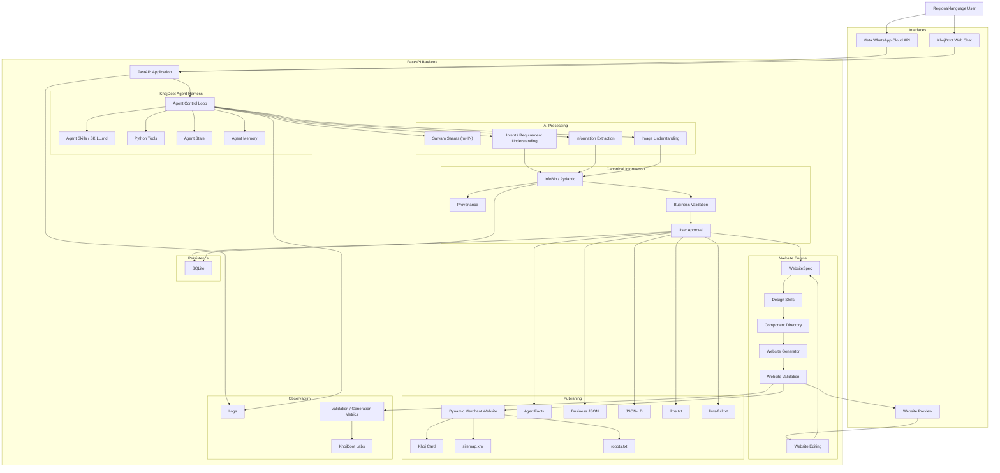

# KhojDoot Technical Requirements Document (TRD)

**Version:** TRD v2.0  
**Status:** Hackathon implementation document  
**Scope:** Technical implementation, ownership, integration, testing, deployment  
**Problem Statement:** Regional-Language No-Code Website Creation Platform  
**Relationship to previous TRD:** This document updates the existing TRD without discarding the work already assigned to the team.

The main principle is simple: **the team keeps its existing technical roles. The new problem statement adds responsibilities inside those roles.** The purpose is to avoid restarting the project while bringing the implementation into alignment with the new website-generation requirements.

The previous TRD established the core responsibilities for FastAPI, persistence, AI processing, frontend, QA, AgentFacts, publishing, and integration. Those responsibilities remain the foundation.

---

# 1. Technical objective

The final system must support this end-to-end flow:

```text
Regional-language user
        ↓
WhatsApp / Web Chat
        ↓
FastAPI
        ↓
KhojDoot Agent Harness
        ↓
Requirement Understanding
        ↓
InfoBin
        ↓
Validation
        ↓
User Approval
        ↓
WebsiteSpec
        ↓
Website Generation
        ↓
Website Validation
        ↓
Editable Website
        ↓
Publication
        ↓
AgentFacts + Crawlable Assets
```

The previous system ended primarily at:

```text
Merchant
 ↓
InfoBin
 ↓
Approval
 ↓
AgentFacts
 ↓
Khoj Card
```

The new technical layer is:

```text
Approved InfoBin
      ↓
WebsiteSpec
      ↓
Component Directory
      ↓
Website Generation
      ↓
Website Validation
      ↓
Editing
      ↓
Revalidation
```

This is the primary technical change caused by the new problem statement.

The problem statement specifically requires natural-language requirement interpretation, code generation, editable website output, validation, decision support, multilingual usability, and measurable evidence.

---

# 2. Technical architecture



---

# 3. Existing role → new role mapping

The team does **not** need a new organizational structure.

| Person | Previous role | What stays the same | New responsibility |
|---|---|---|---|
| Ankur | System architect / integration | Architecture, contracts, integration, demo | Integrate website-generation architecture and keep new modules aligned |
| Abhishek | FastAPI / backend | API, WhatsApp, Agent Harness integration, deployment | Add website-generation, WebsiteSpec, editing and validation API connections |
| Shantanu | Database / InfoBin persistence | SQLite, InfoBin, provenance, CRUD | Persist WebsiteSpec, website versions, validation results and relevant metrics |
| Paksha | AI processing / Agent Skills | Sarvam, Jev, Gemini, extraction, AI validation | Requirement understanding, website planning/generation AI integration, design/skill support |
| Gayatri | Frontend / publishing interface | Web Chat, Khoj Card, dynamic route, publishing UI | Website preview, website editor, generated-site interface and WebsiteSpec-driven UI |
| Sakshi | QA / technical validation | Test matrix, API tests, multilingual tests, E2E testing | Website generation validation, edit/revalidation testing and competition evidence |

---

# 4. Ankur — System Architect and Integration Owner

## Existing responsibility — remains

Ankur owns system-level integration.

Existing responsibilities remain:

- Maintain PRD and TRD.
- Freeze technical contracts.
- Define implementation order.
- Review architecture changes.
- Review interface-changing PRs.
- Connect backend modules.
- Connect frontend and backend.
- Resolve cross-module conflicts.
- Run end-to-end tests.
- Maintain the demo path.
- Maintain deployment configuration.
- Ensure the happy path remains functional.

## New responsibility

Ankur additionally owns the integration of the new website-generation layer.

Specifically:

```text
InfoBin
   ↓
WebsiteSpec
   ↓
Website Generator
   ↓
Website Validation
   ↓
Frontend Preview
```

Ankur must:

1. Define the WebsiteSpec contract.
2. Define the boundary between InfoBin and WebsiteSpec.
3. Define the boundary between backend and frontend.
4. Define the website-generation integration sequence.
5. Ensure website generation does not break merchant onboarding.
6. Ensure generated website information comes from approved InfoBin data.
7. Integrate website validation into the main flow.
8. Maintain the final end-to-end demo.
9. Decide which P1/P2 features are cut if they threaten the core demo.

## Primary integration question

Ankur should continuously ask:

> “What is the next working connection?”

rather than attempting to personally implement every module.

---

# 5. Abhishek — FastAPI and Backend Owner

## Existing responsibility — remains

Abhishek continues to own:

```text
FastAPI
├── Application
├── Routes
├── WhatsApp webhook
├── Request handling
├── Merchant API
├── Agent integration
└── Backend runtime
```

Existing work remains:

- FastAPI application.
- Health endpoint.
- Merchant API.
- WhatsApp webhook.
- Agent Harness connection.
- Database connection.
- AI service connections.
- Structured API responses.
- Backend error handling.
- Deployment.

## New responsibility

Abhishek adds the backend interface for website creation.

Required backend capabilities:

```text
Merchant
 ↓
Process requirement
 ↓
Create/update InfoBin
 ↓
Create WebsiteSpec
 ↓
Generate website
 ↓
Validate website
 ↓
Edit website
 ↓
Publish
```

Conceptual endpoints:

```text
POST /merchants/{id}/process

POST /merchants/{id}/website/generate

GET  /merchants/{id}/website

POST /merchants/{id}/website/edit

POST /merchants/{id}/website/validate

POST /merchants/{id}/publish
```

The exact endpoint names must be finalized in the API contract.

## Backend integration boundary

Abhishek does not own the website's visual design.

He owns:

```text
Frontend request
      ↓
API
      ↓
Website service
      ↓
WebsiteSpec / generation
      ↓
Response
```

---

# 6. Shantanu — Database and InfoBin Persistence Owner

## Existing responsibility — remains

Shantanu continues to own:

- SQLite.
- Database initialization.
- Merchant records.
- InfoBin persistence.
- Provenance persistence.
- Approval status.
- Published state.
- CRUD functions.

## New responsibility

The new website workflow requires persistence for:

```text
WebsiteSpec
Website version
Website status
Validation result
Generation status
Edit history where required
Basic generation metrics
```

Conceptually:

```text
Merchant
   │
   ├── InfoBin
   ├── Provenance
   ├── Approval
   ├── WebsiteSpec
   ├── WebsiteVersion
   ├── ValidationResult
   └── PublicationStatus
```

## Important rule

InfoBin remains the source of business truth.

WebsiteSpec must not become a second business-information database.

For example:

```text
Business phone number
        ↓
InfoBin

WebsiteSpec
        ↓
references / presents phone number
```

not two independent phone-number records.

## Schema coordination

The existing rule remains:

> The database schema must be agreed before Abhishek and Shantanu independently modify it.

This becomes even more important because WebsiteSpec and validation data are now being added.

---

# 7. Paksha — AI Processing and Agent Skills Owner

## Existing responsibility — remains

Paksha continues to own:

```text
Sarvam (Saaras mr-IN)
Jev
Gemini 3.6 Flash
Extraction
AI validation
Agent Skills
Agent-processing integration
```

## Existing AI flow

```text
Voice
 ↓
Sarvam (Saaras mr-IN)

User input
 ↓
Jev / requirement understanding

Text / Images
 ↓
Gemini 3.6 Flash

All
 ↓
Structured information
 ↓
InfoBin
```

## New responsibility

The AI layer now also needs to understand website requirements.

For example:

```text
"माझ्या दुकानासाठी साधी website बनवा.
Menu मोठा दाखवा आणि WhatsApp button ठेवा."
```

must become structured requirements.

Conceptually:

```text
Regional-language input
        ↓
Requirement understanding
        ↓
Business information
        +
Website requirements
        ↓
InfoBin + WebsiteSpec inputs
```

Paksha's new technical responsibilities include:

1. Requirement extraction.
2. Website requirement classification.
3. Structured website requirement output.
4. Website content generation where required.
5. Website planning assistance.
6. AI-assisted design/skill integration.
7. AI response validation.
8. Integration with the Agent Harness.

## Agent Skills

The existing `SKILL.md` architecture remains.

New skills can include:

```text
skills/
├── onboarding/
├── requirement-understanding/
├── website-planning/
├── frontend-design/
├── website-generation/
├── website-editing/
└── website-validation/
```

The exact skill set should be kept small enough for the hackathon.

The important requirement is that skills produce structured, controlled outputs.

---

# 8. Gayatri — Frontend and Website Interface Owner

This role changes the most visibly because the new problem statement requires an editable website.

## Existing responsibility — remains

Gayatri continues to own:

- Web Chat.
- Khoj Card.
- Dynamic merchant route.
- Business JSON display.
- JSON-LD integration.
- KhojDoot Labs interface.
- Frontend API integration.

The dynamic merchant route remains:

```text
/merchant/[slug]
```

## New responsibility

Gayatri additionally owns the user-facing website creation interface.

This includes:

```text
Website Preview
Website Editor
Generated Website UI
Website version display
Edit controls
Validation-result presentation
```

The frontend should consume the backend's WebsiteSpec and generated output.

Conceptually:

```text
Backend
  ↓
WebsiteSpec
  ↓
Frontend renderer / generated website
  ↓
Preview
```

## Website editor

The primary editing interface can be conversational:

```text
User:
"Remove testimonials."

Frontend
 ↓
Backend
 ↓
Agent
 ↓
WebsiteSpec update
 ↓
Updated preview
```

A secondary visual interface may expose:

```text
Sections
Components
Order
Theme
Content
```

if time permits.

## Component Directory

The technical website components should be defined as reusable components:

```text
Hero
About
Services
Products
Gallery
Testimonials
Pricing
FAQ
Location
Contact
Footer
```

Gayatri should integrate these into the frontend system rather than create an entirely separate website implementation for every merchant.

## Design skills / SKILL.md

The website-generation design process should use the agreed skill structure and WebsiteSpec.

The implementation boundary is:

```text
Design Skill
      ↓
WebsiteSpec
      ↓
Frontend implementation
```

rather than manually designing every generated website from zero.

---

# 9. Sakshi — QA and Technical Validation Owner

## Existing responsibility — remains

Sakshi continues to own:

- Test matrix.
- Test inputs.
- Multilingual tests.
- Voice tests.
- Image tests.
- API tests.
- Agent-state tests.
- InfoBin validation tests.
- Merchant approval tests.
- AgentFacts tests.
- Crawlable asset tests.
- End-to-end tests.
- Demo checklist.

## New responsibility

Sakshi now adds the website-generation validation layer.

Tests must include:

```text
Requirement
 ↓
WebsiteSpec
 ↓
Website
 ↓
Validation
 ↓
Edit
 ↓
Revalidation
```

Specific tests:

### Website generation

- WebsiteSpec is valid.
- Required sections exist.
- Known components are used.
- Website renders.
- Business information appears correctly.

### Multilingual generation

```text
English
Marathi
Telugu
```

should be tested according to the actual supported configuration.

### Editing

Test:

```text
Add section
Remove section
Update content
Reorder section
Change style
```

### Validation

Test:

```text
Valid website → PASS

Missing required field → FAIL

Broken output → FAIL

Corrected output → PASS
```

### Competition evidence

Sakshi should maintain a clear validation record showing measurable results.

Example:

```text
Website generation: PASS
Required sections: 6/6
Business information: PASS
Mobile rendering: PASS
Links: PASS
Language: PASS
Overall: 6/6
```

---

# 10. AgentFacts and publishing ownership

The existing AgentFacts responsibilities remain.

The implementation owner must:

- Use the selected AgentFacts repository/schema.
- Understand the actual schema.
- Implement the generator.
- Validate the artifact.
- Map approved InfoBin fields.
- Generate the artifact.
- Test it.
- Integrate it into publication.

The existing TRD explicitly says AgentFacts fields must not be invented.

The new website flow does not replace this.

It becomes:

```text
Approved InfoBin
      │
      ├── Website
      ├── AgentFacts
      ├── Business JSON
      ├── JSON-LD
      ├── llms.txt
      └── Other crawlable assets
```

---

# 11. Updated component ownership matrix

| Component | Primary owner | Supporting owner |
|---|---|---|
| FastAPI | Abhishek | Ankur |
| WhatsApp webhook | Abhishek | Ankur |
| Agent Harness | Abhishek / Paksha | Ankur |
| Agent Skills | Paksha | Ankur |
| Agent Tools | Abhishek | Shantanu |
| Agent State | Abhishek | Ankur |
| Agent Memory | Shantanu | Abhishek |
| Sarvam | Paksha | Abhishek |
| Jev | Paksha | Abhishek |
| Gemini | Paksha | Abhishek |
| Requirement understanding | Paksha | Ankur |
| InfoBin schema | Shantanu + Paksha | Ankur |
| InfoBin persistence | Shantanu | Abhishek |
| Provenance | Shantanu | Paksha |
| Business validation | Paksha + Shantanu | Sakshi |
| Merchant approval | Abhishek | Sakshi |
| WebsiteSpec | Ankur + Paksha | Gayatri |
| Component Directory | Gayatri | Ankur |
| Design Skills | Paksha | Gayatri |
| Website generation integration | Abhishek | Ankur / Gayatri |
| Website validation | Sakshi | Paksha + Abhishek |
| Website editing | Gayatri | Abhishek / Ankur |
| Website preview | Gayatri | Abhishek |
| Dynamic website route | Gayatri | Abhishek |
| Business JSON | Gayatri | Abhishek |
| JSON-LD | Gayatri | Abhishek |
| Agent Card | Gayatri / backend integration | Ankur |
| `llms.txt` | Gayatri | Abhishek |
| `llms-full.txt` | Gayatri | Abhishek |
| `sitemap.xml` | Gayatri | Abhishek |
| `robots.txt` | Gayatri | Abhishek |
| AgentFacts | Assigned implementation owner | Ankur |
| Khoj Card | Gayatri | Abhishek |
| KhojDoot Labs | Gayatri | Ankur |
| Generation metrics | Shantanu | Sakshi |
| Validation metrics | Sakshi | Shantanu |
| Logs | Abhishek | Ankur |
| QA | Sakshi | Everyone |
| Deployment | Abhishek | Ankur |
| Integration | Ankur | Everyone |
| Final demo | Ankur | Everyone |

---

# 12. New technical contracts

The existing internal contract was:

```text
Raw Input
    ↓
Processed Input
    ↓
Extracted Facts
    ↓
InfoBin
    ↓
Validated InfoBin
    ↓
Approved InfoBin
    ↓
Published Assets
```

It is now extended to:

```text
Raw Input
    ↓
Processed Input
    ↓
Extracted Facts
    ↓
InfoBin
    ↓
Validated InfoBin
    ↓
Approved InfoBin
    │
    ├───────────────┐
    ↓               ↓
WebsiteSpec      Publishing
    ↓               ↓
Website         AgentFacts
    ↓           Business JSON
Validation       JSON-LD
    ↓            llms.txt
Edit              etc.
    ↓
Revalidation
    ↓
Published Website
```

---

# 13. WebsiteSpec contract

WebsiteSpec is the most important new internal contract.

Conceptually:

```json
{
  "merchant_id": "example",
  "language": "mr-IN",
  "theme": {
    "style": "minimal"
  },
  "sections": [
    {
      "id": "hero",
      "type": "hero"
    },
    {
      "id": "products",
      "type": "products"
    },
    {
      "id": "location",
      "type": "location"
    },
    {
      "id": "contact",
      "type": "contact"
    }
  ]
}
```

The exact schema must be frozen before frontend and backend integration.

Ownership:

```text
Ankur
 ↓
defines contract

Paksha
 ↓
AI generation / planning

Gayatri
 ↓
frontend consumption

Abhishek
 ↓
API integration

Shantanu
 ↓
persistence

Sakshi
 ↓
validation
```

---

# 14. Website generation contract

```text
WebsiteSpec
     ↓
Component validation
     ↓
Component selection
     ↓
Generation
     ↓
Build
     ↓
Render
     ↓
Validation
```

A generated website is not considered complete merely because code was generated.

It must:

```text
Build
Render
Pass required validation
```

---

# 15. Website editing contract

Editing follows:

```text
User request
      ↓
Agent interprets request
      ↓
Structured edit
      ↓
WebsiteSpec update
      ↓
Website regeneration/update
      ↓
Validation
      ↓
Preview
```

Examples:

```text
"Remove testimonials."
"Add a gallery."
"Move menu above about."
"Make the website more traditional."
"Add WhatsApp contact."
```

The system should modify WebsiteSpec rather than directly asking an LLM to rewrite arbitrary frontend code.

---

# 16. Website validation contract

Validation should return structured output.

Example:

```json
{
  "status": "passed",
  "score": 8,
  "checks": [
    {
      "name": "required_sections",
      "status": "passed"
    },
    {
      "name": "business_information",
      "status": "passed"
    },
    {
      "name": "links",
      "status": "passed"
    }
  ]
}
```

This allows the frontend to display evidence without implementing its own validation logic.

---

# 17. Updated API contract

The previous API contract remains valid for the existing system. The new website layer adds:

```text
POST /merchants/{id}/website/generate

GET  /merchants/{id}/website

GET  /merchants/{id}/website/spec

POST /merchants/{id}/website/edit

POST /merchants/{id}/website/validate

GET  /merchants/{id}/website/validation

POST /merchants/{id}/publish
```

The exact final endpoints belong in `API.md`.

---

# 18. Updated repository structure

```text
khojdoot/
│
├── backend/
│   ├── main.py
│   │
│   ├── routes/
│   │   ├── whatsapp.py
│   │   ├── merchants.py
│   │   ├── website.py
│   │   └── assets.py
│   │
│   ├── agent/
│   │   ├── harness.py
│   │   ├── state.py
│   │   ├── memory.py
│   │   ├── skills/
│   │   │   ├── onboarding/
│   │   │   ├── requirement-understanding/
│   │   │   ├── website-planning/
│   │   │   ├── website-generation/
│   │   │   └── website-editing/
│   │   └── tools/
│   │       └── merchant_tools.py
│   │
│   ├── ai/
│   │   ├── sarvam.py
│   │   ├── jev.py
│   │   └── gemini.py
│   │
│   ├── infobin/
│   │   ├── schema.py
│   │   ├── service.py
│   │   └── provenance.py
│   │
│   ├── website/
│   │   ├── schema.py
│   │   ├── planner.py
│   │   ├── generator.py
│   │   ├── validator.py
│   │   └── editor.py
│   │
│   ├── components/
│   │   ├── hero/
│   │   ├── products/
│   │   ├── services/
│   │   ├── gallery/
│   │   ├── about/
│   │   ├── contact/
│   │   └── footer/
│   │
│   ├── agentfacts/
│   │   ├── generator.py
│   │   └── validator.py
│   │
│   ├── publishing/
│   │   ├── json.py
│   │   ├── jsonld.py
│   │   ├── llms.py
│   │   ├── sitemap.py
│   │   └── robots.py
│   │
│   ├── database/
│   │   ├── connection.py
│   │   ├── merchants.py
│   │   ├── website.py
│   │   └── facts.py
│   │
│   └── tests/
│
├── frontend/
│   ├── app/
│   │   ├── merchant/
│   │   │   └── [slug]/
│   │   ├── chat/
│   │   ├── editor/
│   │   └── labs/
│   │
│   └── components/
│
├── docs/
│   ├── PRD.md
│   ├── TRD.md
│   └── API.md
│
└── README.md
```

This extends the previous repository structure rather than replacing it.

---

# 19. Integration order

The updated order is:

```text
1. FastAPI
      ↓
2. SQLite
      ↓
3. InfoBin
      ↓
4. Merchant state
      ↓
5. Agent Harness
      ↓
6. Agent Skills
      ↓
7. AI processing
      ↓
8. Validation
      ↓
9. Merchant approval
      ↓
10. WebsiteSpec
      ↓
11. Component Directory
      ↓
12. Website generation
      ↓
13. Website validation
      ↓
14. Preview
      ↓
15. Website editing
      ↓
16. Revalidation
      ↓
17. Dynamic website
      ↓
18. AgentFacts
      ↓
19. Crawlable assets
      ↓
20. Khoj Card
      ↓
21. WhatsApp
      ↓
22. Deployment
      ↓
23. End-to-end demo
```

---

# 20. Team integration checkpoints

## Checkpoint 1 — Backend

```text
FastAPI
 ↓
Health endpoint
```

Owner: Abhishek.

## Checkpoint 2 — Persistence

```text
FastAPI
 ↓
SQLite
 ↓
Merchant
```

Owners: Abhishek + Shantanu.

## Checkpoint 3 — AI

```text
Input
 ↓
AI
 ↓
InfoBin
```

Owners: Paksha + Abhishek + Shantanu.

## Checkpoint 4 — Validation

```text
InfoBin
 ↓
Validation
 ↓
Approval
```

Owners: Paksha + Shantanu + Sakshi.

## Checkpoint 5 — Website specification

```text
Approved InfoBin
 ↓
WebsiteSpec
```

Owners: Ankur + Paksha.

## Checkpoint 6 — Website

```text
WebsiteSpec
 ↓
Components
 ↓
Generated website
```

Owners: Gayatri + Abhishek.

## Checkpoint 7 — Website validation

```text
Website
 ↓
Validation
 ↓
Evidence
```

Owners: Sakshi + Abhishek.

## Checkpoint 8 — Editing

```text
User edit
 ↓
WebsiteSpec
 ↓
Updated website
 ↓
Validation
```

Owners: Gayatri + Ankur + Abhishek.

## Checkpoint 9 — Publication

```text
Approved data
 ↓
Website
 ↓
AgentFacts
 ↓
Crawlable assets
```

Owners: Gayatri + assigned AgentFacts owner + Abhishek.

## Checkpoint 10 — Complete demo

```text
Regional language
 ↓
Website
 ↓
Edit
 ↓
Validation
 ↓
Publication
```

Owner: Ankur, with the entire team.

---

# 21. Updated testing matrix

| Input | English | Marathi | Telugu |
|---|---:|---:|---:|
| Text | ✓ | ✓ | ✓ |
| Voice | ✓ | ✓ | ✓ |
| Image | ✓ | ✓ | ✓ |

Website validation matrix:

| Capability | Test |
|---|---|
| Requirement extraction | Requirement becomes structured data |
| InfoBin | Correct business fields |
| WebsiteSpec | Valid structure |
| Website generation | Website renders |
| Website validation | Correct PASS/FAIL |
| Editing | Requested change is applied |
| Revalidation | Modified site is checked again |
| Publication | Public route works |
| AgentFacts | Valid artifact |
| Crawlable assets | Files resolve |
| Mobile layout | Usable mobile page |
| Multilingual content | Selected language is preserved |

---

# 22. Definition of done

The new competition-critical definition of done is:

```text
User
 ↓
Regional-language requirement
 ↓
Requirement understood
 ↓
InfoBin created
 ↓
InfoBin validated
 ↓
User approval
 ↓
WebsiteSpec created
 ↓
Website generated
 ↓
Website validated
 ↓
Website preview shown
 ↓
User edits website
 ↓
Website updated
 ↓
Website revalidated
 ↓
Website published
```

---

# 23. What the team should not change

The following existing architecture should remain stable:

```text
FastAPI
SQLite
InfoBin
Pydantic
Agent Harness
SKILL.md
Python tools
Sarvam (Saaras mr-IN)
Jev
Gemini 3.6 Flash
AgentFacts
Dynamic merchant route
Khoj Card
WhatsApp integration
```

The new problem statement does **not** require replacing these components. It requires adding the missing website-generation workflow around them.

---

# 24. What is newly required

The team should specifically recognize these as the new technical requirements:

```text
Website requirements extraction
        ↓
WebsiteSpec
        ↓
Component Directory
        ↓
Design Skills
        ↓
Website generation
        ↓
Website validation
        ↓
Website preview
        ↓
Website editing
        ↓
Revalidation
        ↓
Generation / validation metrics
```

---

# 25. Final responsibility model

The updated project can be understood as six connected ownership areas:

```text
                 KHOJDOOT
                     │
     ┌───────────────┼────────────────┐
     │               │                │
     ▼               ▼                ▼
  BACKEND          AI/DATA         WEBSITE
 Abhishek       Paksha/Shantanu     Gayatri
     │               │                │
     └───────────────┼────────────────┘
                     │
                     ▼
                  TESTING
                   Sakshi
                     │
                     ▼
                INTEGRATION
                   Ankur
```

More precisely:

```text
Ankur
System + Integration
        │
        ├── Architecture
        ├── Contracts
        ├── WebsiteSpec boundary
        └── End-to-end demo

Abhishek
Backend
        │
        ├── FastAPI
        ├── WhatsApp
        ├── APIs
        ├── Agent integration
        └── Website backend services

Shantanu
Persistence
        │
        ├── SQLite
        ├── InfoBin
        ├── Provenance
        ├── WebsiteSpec persistence
        └── Metrics persistence

Paksha
AI + Skills
        │
        ├── Sarvam (Saaras mr-IN)
        ├── Jev
        ├── Gemini 3.6 Flash
        ├── Requirement understanding
        └── Website planning / skills

Gayatri
Frontend + Website
        │
        ├── Web Chat
        ├── Website preview
        ├── Website editor
        ├── Components
        ├── Khoj Card
        └── Publishing interface

Sakshi
QA + Validation
        │
        ├── Existing QA
        ├── Website validation
        ├── Edit/revalidation tests
        └── Demo evidence
```
