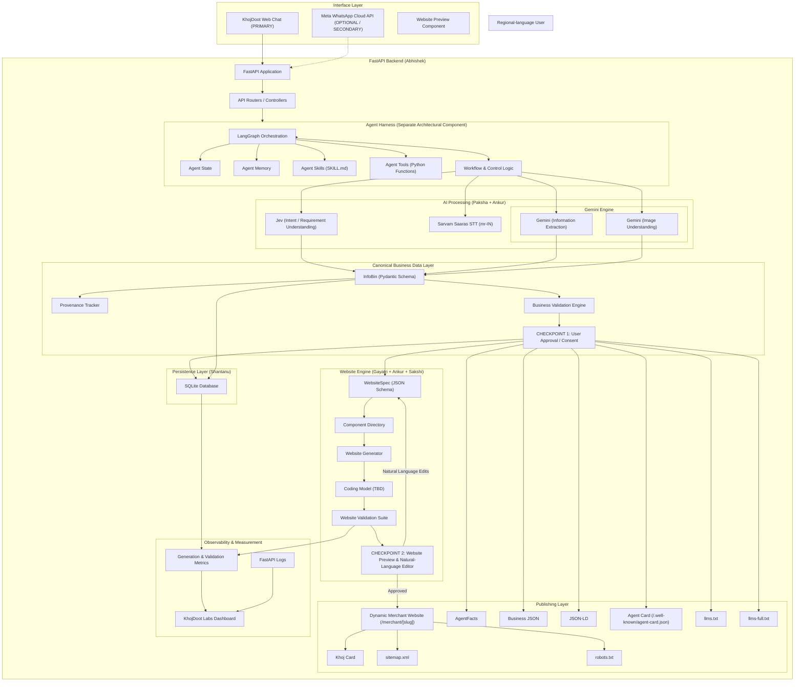
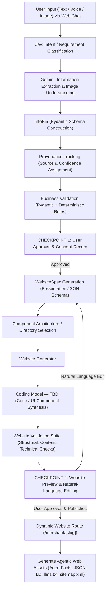

# KhojDoot Technical Requirements Document (TRD)

**Version:** TRD v2.0  
**Status:** Hackathon implementation document  
**Scope:** Technical architecture, component boundaries, interfaces, AI models, data flows, persistence, team responsibilities  
**Problem Statement:** Regional-Language No-Code Website Creation Platform  
**Relationship to baseline:** Updates baseline TRD while retaining existing architectural foundations, tools, and team roles.

---

# 1. Technical objective

The system supports a 14-step technical workflow connecting regional-language inputs to generated websites and agentic-web assets:

```text
1. User Input (Web Chat / Optional WhatsApp)
        ↓
2. Speech-to-Text (Sarvam Saaras mr-IN) / Image Processing
        ↓
3. Intent & Requirement Understanding (Jev)
        ↓
4. Information Extraction (Gemini)
        ↓
5. Canonical InfoBin (Pydantic Schema + Provenance)
        ↓
6. Business Data Validation
        ↓
7. CHECKPOINT 1: User Approval & Consent Record
        ↓
8. WebsiteSpec Generation (Presentation Schema)
        ↓
9. Bounded Component Selection & Website Generation (Coding Model — TBD)
        ↓
10. Website Validation Suite & Evidence Metrics
        ↓
11. CHECKPOINT 2: Website Preview & Natural-Language Editing
        ↓
12. Spec Patching & Re-validation
        ↓
13. Dynamic Website Publication (/merchant/[slug])
        ↓
14. Agentic Web Assets Generation (AgentFacts, JSON-LD, llms.txt, sitemap.xml)
```

The core technical addition is the **Website Engine** (`WebsiteSpec` $\rightarrow$ `Component Directory` $\rightarrow$ `Website Generator` $\rightarrow$ `Coding Model — TBD` $\rightarrow$ `Website Validation` $\rightarrow$ `Website Preview` $\rightarrow$ `Re-validation`), bridging business facts (`InfoBin`) with published sites.

---

# 2. System architecture



---

# 3. Technical flow diagram



---

# 4. Interface architecture & boundaries

## 4.1 Primary Interface: KhojDoot Web Chat
- **Tech:** Single-page web application frontend communicating via REST APIs with FastAPI.
- **Role:** Handles primary requirement input, voice recording, photo uploads, Checkpoint 1 info approval UI, Checkpoint 2 website preview, and conversational editing controls.

## 4.2 Secondary Interface: Meta WhatsApp Cloud API (Optional)
- **Tech:** Webhook handlers (`/api/whatsapp/webhook`).
- **Role:** Connects optional mobile messaging inputs directly to the FastAPI API router. Uses the exact same backend engine as Web Chat.

---

# 5. FastAPI backend responsibility & boundary (Abhishek)

## 5.1 Abhishek's Core Responsibilities
- FastAPI application setup (`app/main.py`), CORS middleware, static file mounts.
- API route definitions (`routes/merchants.py`, `routes/website.py`, `routes/assets.py`).
- Request/response handling, multipart form parsing, and HTTP status codes.
- Connecting frontend API requests to the Agent Harness execution interface.
- Database CRUD integration with Shantanu's persistence modules.
- Endpoints for Checkpoint 1 (Approval) and Checkpoint 2 (Website Preview/Edit/Publish).

## 5.2 Explicit Boundary
- **Abhishek DOES NOT own the internal implementation of the Agent Harness.**
- He integrates FastAPI with the Agent Harness through a defined contract: `harness.execute_workflow(request_context)`.
- He does not design the internal control loop, LangGraph node graph, skills, state, or memory algorithms.

---

# 6. Agent Harness internal architecture

The Agent Harness executes the workflow orchestration.

```text
Agent Harness
├── LangGraph Orchestration (Workflow Node Graph)
├── Agent State (Active step, active merchant, pending modifications)
├── Agent Memory (Short-term context + Long-term InfoBin reference)
├── Agent Skills (SKILL.md execution rules)
├── Agent Tools (Controlled Python function calling)
└── Workflow / Control Logic
```

- **LangGraph Placement:** Manages state transitions between nodes: `understand_requirement` $\rightarrow$ `extract_facts` $\rightarrow$ `validate_infobin` $\rightarrow$ `await_approval` $\rightarrow$ `generate_spec` $\rightarrow$ `generate_code` $\rightarrow$ `validate_website` $\rightarrow$ `await_preview_edit`.
- **Tools:** Controlled Python functions only (`create_merchant`, `save_infobin`, `validate_spec`, `patch_spec`, `publish_assets`). The model is never granted raw database or filesystem access.

---

# 7. AI processing architecture (Paksha + Ankur)

## 7.1 Speech-to-Text: Sarvam Saaras
- **Model:** `saaras:v1` (`language_code="mr-IN"`).
- **Role:** Converts regional-language `.ogg`/`.wav` voice notes into clean Marathi/Hindi text.

## 7.2 Intent / Requirement Understanding: Jev
- **Role:** Classifies whether the user is providing new business details, answering a clarification question, or requesting a website edit.

## 7.3 Information & Vision Extraction: Gemini
Gemini is assigned two **explicit, distinct responsibilities**:
1. **Information Extraction:** Extracts structured entities (business name, category, services, menu items, prices, hours) into `InfoBin` JSON schema.
2. **Image Understanding:** Parses uploaded menu photos, handwritten rate cards, and shop signs to extract textual business facts.

---

# 8. InfoBin, Pydantic, and Provenance

## 8.1 InfoBin Schema (Pydantic)
`InfoBin` is the canonical source of truth for business information:
```json
{
  "name": "Sunita Tiffin Service",
  "category": "home_food",
  "location": "Gangapur Road, Nashik",
  "phone": "+91 9423375197",
  "services": "Homemade Veg Tiffin",
  "menu": [
    {"item": "साधा टिफिन", "price": 80},
    {"item": "स्पेशल टिफिन", "price": 100}
  ],
  "hours": "11:00 AM - 3:00 PM",
  "language": "mr-IN"
}
```

## 8.2 Provenance Tracking
`Provenance` tracks the origin and confidence of every business fact:
- **Sources:** `USER_TEXT`, `USER_VOICE`, `USER_IMAGE`, `AI_INFERENCE`, `USER_EDIT`.
- **Purpose:** 
  1. **Traceability:** Know exactly which image or voice note produced a price.
  2. **Conflict Resolution:** User text overrides AI inference; user edits override extracted values.
  3. **Evidence & Validation:** Track whether facts are confirmed by the merchant.

---

# 9. Two distinct user checkpoints

The system enforces **two explicit user interaction checkpoints**:

```text
CHECKPOINT 1: Business Information Approval / Consent
[ Extracted Facts ] ──> [ InfoBin ] ──> [ Validation ] ──> [ USER APPROVAL ] ──> [ Consent Record ]

                                                               │ (Unlocks)
                                                               ▼
CHECKPOINT 2: Website Preview & Natural-Language Editing
[ WebsiteSpec ] ──> [ Generator ] ──> [ Coding Model — TBD ] ──> [ Validation ] ──> [ PREVIEW ] ──> [ USER EDIT / PUBLISH ]
```

1. **Checkpoint 1 (Business Info Approval):** User explicitly verifies extracted business facts in Web Chat before site code generation begins.
2. **Checkpoint 2 (Website Preview & Editing):** User inspects rendered site preview, requests conversational edits, triggers spec patching & re-validation, and clicks "Publish".

---

# 10. Website Engine & Coding Model Architecture

The Website Engine converts approved business facts into rendered sites:

```text
Approved InfoBin
      ↓
WebsiteSpec (JSON Schema Presentation Model)
      ↓
Component Architecture / Directory (Hero, Products, Location, Contact, Footer)
      ↓
Website Generator
      ↓
Coding Model — TBD (Synthesizes UI components & code layout)
      ↓
Generated Website
      ↓
Website Validation Suite (Structural, Content, Technical, Mobile checks)
      ↓
Website Preview (Checkpoint 2)
      ↓
User Edit / Review
      ↓
Re-validation
      ↓
Publish to Dynamic Route (/merchant/[slug])
```

- **WebsiteSpec:** Structured JSON defining active sections, theme style, component variants, and content references.
- **Component Directory:** Pre-built, bounded frontend components preventing uncontrolled LLM code generation.
- **Coding Model — TBD:** The AI coding model responsible for synthesizing components according to `WebsiteSpec` rules.

---

# 11. Publishing layer & agentic web assets

Upon final publication, the backend generates both human-facing and machine-readable assets:

- **Dynamic Merchant Website:** `/merchant/[slug]` (rendered human-facing website).
- **Khoj Card:** Visually verified SME profile card.
- **AgentFacts:** Canonical machine-readable JSON artifact conforming to the AgentFacts repository schema.
- **Business JSON:** `/merchant/[slug]/facts.json`.
- **JSON-LD:** Embedded Schema.org structured data.
- **Agent Card:** `/.well-known/agent-card.json`.
- **`llms.txt` / `llms-full.txt`:** Context files for AI crawlers.
- **`sitemap.xml` & `robots.txt`:** Standard web indexing files.

---

# 12. Persistence architecture (Shantanu)

SQLite (`khoj_doot.db`) stores all persistent data across 6 relational tables:

```text
shops             (id, sme_id, slug, name, phone, city, status, created_at, updated_at)
bins              (id, shop_id, bin_type, data)
photos            (id, shop_id, filename, source)
provenance        (id, shop_id, field_name, source_type, confidence, confirmed)
consent_records   (id, shop_id, consent_type, approved_at, payload_hash)
website_specs     (id, shop_id, version, spec_data, validation_score, status)
```

---

# 13. Team technical responsibilities & boundaries

## 13.1 Ankur — System Architecture / AI Integration / End-to-End Integration
- **Existing & Retained:** Overall system architecture, technical integration, AI component wiring, AgentFacts / Agent Card integration, end-to-end demo path.
- **New Responsibilities:** Integrate website generation layer into core pipeline; define & maintain contracts between Agent Harness, InfoBin, WebsiteSpec, Website Generator, and Publishing; coordinate end-to-end hackathon demo.
- **Boundary:** Architecture and integration lead; does not write every backend route or frontend component personally.

## 13.2 Abhishek — Backend / FastAPI Engineer
- **Existing & Retained:** FastAPI application framework (`app/main.py`), API routing, backend runtime, deployment.
- **New Responsibilities:** APIs for Web Chat backend, website generation endpoints (`/generate`, `/edit`, `/preview`, `/publish`), backend database integration.
- **Boundary:** Owns FastAPI & REST endpoints. **Does NOT own Agent Harness internal control loops or LangGraph graph definitions.**

## 13.3 Shantanu — Database / Persistence / Data Support
- **Existing & Retained:** SQLite database management, schema initialization, `InfoBin` persistence, CRUD helper functions.
- **New Responsibilities:** Persisting `WebsiteSpec` schemas, version history, `consent_records`, provenance entries, validation scores, and basic metrics.
- **Boundary:** Owns database DDL, queries, and data helper utilities.

## 13.4 Paksha — AI / Python Technical Support / Design Support
- **Existing & Retained:** Assist with Python helper utilities, data transformations, and AI integration scripts.
- **New Responsibilities:**
  - *AI / Python:* Assist with Gemini extraction helpers, Sarvam STT integration helpers, Jev intent parsing helpers, and prompt testing.
  - *Design:* Visual design concepts, component layout ideas, `WebsiteSpec` design direction options, and design `SKILL.md` support.
- **Boundary:** Works within clearly defined function interfaces defined by Ankur; does not own core system architecture.

## 13.5 Gayatri — Frontend Implementation
- **Existing & Retained:** Frontend implementation, Khoj Card, dynamic merchant route.
- **New Responsibilities:** Implement primary **KhojDoot Web Chat** UI, website preview renderer (`/merchant/[slug]`), conversational editing UI, Checkpoint 1 & Checkpoint 2 user approval controls, and component directory implementation.
- **Boundary:** Owns all frontend UI implementation; does not design backend database schemas or FastAPI routers.

## 13.6 Sakshi — QA / Testing / Validation Support
- **Existing & Retained:** Test matrix, functional testing, multilingual test cases, scenario validation.
- **New Responsibilities:** Test cases for requirement understanding, `WebsiteSpec` validation, website renderer testing, Checkpoint 1 & 2 flow verification, regression testing, and demo checklist execution.
- **Boundary:** Owns QA test suites and demo validation evidence.

---

# 14. 10 Technical integration checkpoints

```text
Checkpoint 1:  FastAPI Application & Health Endpoint (/health)
Checkpoint 2:  SQLite Database Schema & CRUD Connection
Checkpoint 3:  Requirement Processing (Jev + Gemini + Sarvam STT) -> InfoBin
Checkpoint 4:  Pydantic Validation & CHECKPOINT 1 (User Info Approval UI)
Checkpoint 5:  Approved InfoBin -> WebsiteSpec Schema Generation
Checkpoint 6:  Website Generator & Coding Model (TBD) Component Synthesis
Checkpoint 7:  Website Validation Suite Execution (Pass/Fail Scorecard)
Checkpoint 8:  CHECKPOINT 2 (Website Preview & Conversational Natural-Language Edit Loop)
Checkpoint 9:  Dynamic Website (/merchant/[slug]) & Agentic Web Asset Generation
Checkpoint 10: End-to-End Live Hackathon Demo Verification
```
