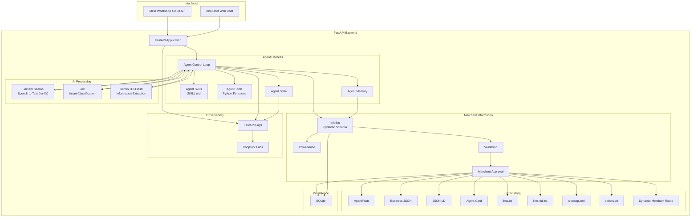

# KhojDoot Technical Requirements Document (TRD)

Version: TRD v1.0  
Status: Working implementation document  
Purpose: Hackathon implementation  
Scope: Technical implementation, interfaces, responsibilities, integration, testing, and deployment  

This TRD converts the PRD into an implementation plan.

The PRD defines what KhojDoot must do.

The TRD defines how the team will build it and who owns each technical part.

---

# 1. Technical objective

The team must build one working end-to-end prototype:

```text
Merchant
   ↓
WhatsApp / Web Chat
   ↓
FastAPI
   ↓
Agent Harness
   ↓
Input + AI Processing
   ↓
InfoBin
   ↓
Validation
   ↓
Merchant Approval
   ↓
AgentFacts
   ↓
Crawlable Assets
   ↓
Khoj Card
```

The system must work with:

* Text.
* Voice.
* Images.
* English.
* Marathi.
* Telugu.

The core implementation must work before ordering features are added.

---

# 2. System architecture



---

# 3. Repository structure

The target structure should be approximately:

```text
khojdoot/
│
├── backend/
│   ├── main.py
│   │
│   ├── routes/
│   │   ├── whatsapp.py
│   │   ├── merchants.py
│   │   └── assets.py
│   │
│   ├── agent/
│   │   ├── harness.py
│   │   ├── state.py
│   │   ├── memory.py
│   │   ├── skills/
│   │   │   └── onboarding/
│   │   │       └── SKILL.md
│   │   └── tools/
│   │       └── merchant_tools.py
│   │
│   ├── ai/
│   │   ├── sarvam.py
│   │   ├── jev.py
│   │   └── gemini.py
│   │
│   ├── infobin/
│   │   ├── schema.py
│   │   ├── service.py
│   │   └── provenance.py
│   │
│   ├── agentfacts/
│   │   ├── generator.py
│   │   └── validator.py
│   │
│   ├── publishing/
│   │   ├── json.py
│   │   ├── jsonld.py
│   │   ├── llms.py
│   │   ├── sitemap.py
│   │   └── robots.py
│   │
│   ├── database/
│   │   ├── connection.py
│   │   ├── merchants.py
│   │   └── facts.py
│   │
│   └── tests/
│
├── frontend/
│   ├── app/
│   │   ├── merchant/
│   │   │   └── [slug]/
│   │   ├── chat/
│   │   └── labs/
│   │
│   └── ...
│
├── docs/
│   ├── PRD.md
│   ├── TRD.md
│   └── API.md
│
└── README.md
```

This is the target organization.

The team should not create every file immediately.

Create files when their component starts.

---

# 4. Technical ownership

## Ankur: System architect and integration owner

Ankur owns the system-level integration.

### Responsibilities

* Maintain PRD and TRD.
* Freeze technical contracts.
* Define integration order.
* Review architecture changes.
* Review pull requests that affect interfaces.
* Connect backend modules.
* Connect frontend and backend.
* Resolve cross-module conflicts.
* Run end-to-end tests.
* Maintain the demo path.
* Maintain the final deployment configuration.
* Verify that no component breaks the happy path.

### Ankur should not own

* Every backend endpoint.
* Every AI integration.
* Every database operation.
* Every frontend component.

The role is integration.

---

# 5. Abhishek: FastAPI and backend owner

Abhishek owns the backend application.

### Responsibilities

```text
FastAPI
├── Application
├── Routes
├── WhatsApp webhook
├── Request handling
├── Merchant API
├── Agent integration
└── Backend runtime
```

### Required work

1. Create the FastAPI application.
2. Create the basic health endpoint.
3. Create the merchant API.
4. Create the WhatsApp webhook.
5. Connect the Agent Harness.
6. Connect database services.
7. Connect AI services.
8. Return structured API responses.
9. Handle backend errors.
10. Prepare the backend for cloud deployment.

### First implementation

```python
from fastapi import FastAPI

app = FastAPI()


@app.get("/")
def health():
    return {
        "status": "ok"
    }
```

This is the first technical milestone.

---

# 6. Shantanu: Database and InfoBin persistence owner

Shantanu owns persistence.

### Responsibilities

* SQLite connection.
* Database initialization.
* Merchant records.
* InfoBin persistence.
* Provenance persistence.
* Approval status.
* Published asset status.
* Database CRUD functions.

### Important rule

The database schema must be agreed before Abhishek and Shantanu independently modify it.

The current repository has conflicting database schemas.

Those conflicts must be resolved before integration.

---

# 7. Paksha: AI processing and agent-processing owner

Paksha owns the AI processing components.

### Responsibilities

```text
Voice
  ↓
Sarvam (Saaras mr-IN)

Input
  ↓
Jev

Text / Images
  ↓
Gemini 3.6 Flash

All
  ↓
Structured information
```

### Specific ownership

* Sarvam integration (`saaras:v1`).
* Jev integration.
* Gemini 3.6 Flash integration.
* Extraction prompt.
* Extraction response format.
* AI error handling.
* AI response validation before InfoBin.
* Integration with Agent Harness.

### Important rule

Paksha does not define the database schema independently.

The AI output must conform to the agreed InfoBin schema.

---

# 8. Gayatri: Frontend and publishing-interface owner

Gayatri owns the user-facing web application.

### Responsibilities

* KhojDoot Web Chat.
* Khoj Card.
* Dynamic merchant route.
* Business JSON display/access.
* JSON-LD integration.
* KhojDoot Labs interface.
* Frontend API integration.

### Dynamic route

The route should use one reusable page:

```text
/merchant/[slug]
```

The slug identifies the merchant.

No separate deployment is required for each merchant.

---

# 9. Sakshi: QA and technical validation owner

Sakshi owns testing.

This is a technical responsibility.

### Responsibilities

* Test matrix.
* Test inputs.
* Multilingual tests.
* Voice tests.
* Image tests.
* API tests.
* Agent state tests.
* InfoBin validation tests.
* Merchant approval tests.
* AgentFacts validation tests.
* Crawlable asset tests.
* End-to-end tests.
* Demo checklist.

### Test matrix

```text
                English  Marathi  Telugu
Text               ✓        ✓        ✓
Voice              ✓        ✓        ✓
Image              ✓        ✓        ✓
```

The exact supported combinations should be tested against actual provider behavior.

---

# 10. AgentFacts ownership

AgentFacts must have an explicit technical owner.

The implementation owner must use the AgentFacts repository provided by the team.

Responsibilities:

* Clone/use the selected repository.
* Understand the actual schema.
* Implement the generator.
* Implement validation.
* Map approved InfoBin fields to the AgentFacts structure.
* Generate the required artifact.
* Test the artifact.
* Integrate it with publishing.

No AgentFacts field should be invented.

---

# 11. Component ownership matrix

| Component           | Primary owner                 | Supporting owner |
| ------------------- | ----------------------------- | ---------------- |
| FastAPI             | Abhishek                      | Ankur            |
| WhatsApp webhook    | Abhishek                      | Ankur            |
| Agent Harness       | Abhishek / Paksha             | Ankur            |
| Agent Skills        | Paksha                        | Ankur            |
| Agent Tools         | Abhishek                      | Shantanu         |
| Agent State         | Abhishek                      | Ankur            |
| Agent Memory        | Shantanu                      | Abhishek         |
| Sarvam              | Paksha                        | Abhishek         |
| Jev                 | Paksha                        | Abhishek         |
| Gemini              | Paksha                        | Abhishek         |
| InfoBin schema      | Shantanu + Paksha             | Ankur            |
| InfoBin persistence | Shantanu                      | Abhishek         |
| Provenance          | Shantanu                      | Paksha           |
| Validation          | Paksha + Shantanu             | Sakshi           |
| Merchant approval   | Abhishek                      | Sakshi           |
| AgentFacts          | Assigned implementation owner | Ankur            |
| Business JSON       | Gayatri                       | Abhishek         |
| JSON-LD             | Gayatri                       | Ankur            |
| Agent Card          | Gayatri / backend integration | Ankur            |
| `llms.txt`          | Gayatri                       | Abhishek         |
| `llms-full.txt`     | Gayatri                       | Abhishek         |
| `sitemap.xml`       | Gayatri                       | Abhishek         |
| `robots.txt`        | Gayatri                       | Abhishek         |
| Dynamic route       | Gayatri                       | Abhishek         |
| Khoj Card           | Gayatri                       | Abhishek         |
| KhojDoot Labs       | Gayatri                       | Ankur            |
| Logs                | Abhishek                      | Ankur            |
| QA                  | Sakshi                        | Everyone         |
| Deployment          | Abhishek                      | Ankur            |
| Integration         | Ankur                         | Everyone         |
| Final demo          | Ankur                         | Everyone         |

---

# 12. API contracts

The team must agree on API contracts before integration.

The exact endpoint names can be finalized in `API.md`.

The minimum backend contract should cover:

```text
Health
Merchant
Onboarding
WhatsApp
Facts
Approval
Publishing
```

Example conceptual API:

```text
GET  /health

POST /merchants

GET  /merchants/{id}

POST /merchants/{id}/process

POST /merchants/{id}/approve

GET  /merchants/{slug}

GET  /merchants/{slug}/facts

GET  /merchants/{slug}/agentfacts

GET  /sitemap.xml

GET  /llms.txt

GET  /llms-full.txt

GET  /robots.txt

GET  /.well-known/agent-card.json
```

These are proposed interface names for the TRD.

They must not be implemented blindly if the existing repository already uses different contracts.

---

# 13. Internal data contract

The central internal contract is:

```text
Raw Input
    ↓
Processed Input
    ↓
Extracted Facts
    ↓
InfoBin
    ↓
Validated InfoBin
    ↓
Approved InfoBin
    ↓
Published Assets
```

The important states are:

```text
DRAFT
PROCESSING
VALIDATED
PENDING_APPROVAL
APPROVED
PUBLISHED
```

The final state model should be implemented consistently across the backend.

---

# 14. Agent execution contract

The Agent Harness should conceptually execute:

```text
Receive input
     ↓
Load state
     ↓
Load relevant memory
     ↓
Load Skill
     ↓
Determine intent
     ↓
Select tool if required
     ↓
Call model/tool
     ↓
Update state
     ↓
Update InfoBin
     ↓
Validate
     ↓
Ask for approval if required
```

The control loop should remain under application control.

The model should not directly control database access.

---

# 15. Agent tool contract

Tools should be controlled Python functions.

Conceptually:

```python
create_merchant(...)
get_merchant(...)
update_merchant(...)
update_infobin(...)
validate_infobin(...)
request_approval(...)
publish_merchant(...)
generate_agentfacts(...)
```

These are conceptual functions.

The final signatures should be defined in code after the InfoBin schema is frozen.

---

# 16. Agent memory contract

Memory has two levels.

### Short-term

Current interaction state.

```text
Current message
Current question
Current onboarding step
Pending confirmation
```

### Persistent

Merchant business information.

```text
Merchant
InfoBin
Provenance
Approval
Published state
```

The two must not be mixed.

---

# 17. AgentFacts publishing contract

The publishing pipeline is:

```text
Approved InfoBin
      ↓
AgentFacts Generator
      ↓
AgentFacts Validation
      ↓
AgentFacts Artifact
      ↓
Public publication
```

If AgentFacts generation fails:

```text
Do not publish invalid AgentFacts.
```

The failure should be logged.

The merchant's approved information must not be silently changed to make the AgentFacts artifact pass validation.

---

# 18. Crawlable asset contract

The publication system generates:

```text
Business JSON
JSON-LD
AgentFacts
Agent Card
llms.txt
llms-full.txt
sitemap.xml
robots.txt
```

The assets must use the same approved source.

Therefore:

```text
Approved InfoBin
       │
       ├── Business JSON
       ├── JSON-LD
       ├── AgentFacts
       ├── llms.txt
       └── llms-full.txt
```

This avoids different versions of the merchant information appearing in different files.

---

# 19. Deployment architecture

## Development

```text
Developer computer
      ↓
Python
      ↓
Uvicorn
      ↓
FastAPI
```

## WhatsApp development

A public HTTPS endpoint is required.

Conceptually:

```text
Meta
 ↓
Public HTTPS endpoint
 ↓
FastAPI
```

A tunnel can be used during local testing.

The previous sandbox failure must not be repeated.

The long-running server must run in a stable environment.

## Final prototype

```text
Internet
   │
   ├── Vercel
   │     └── Next.js
   │
   └── Cloud backend
         └── FastAPI
```

Railway can be used as the cloud backend deployment service if selected.

The exact hosting provider is a deployment decision.

---

# 20. Git workflow

Use one repository.

Use feature branches.

Example:

```text
main
│
├── feature/fastapi
├── feature/infobin
├── feature/ai-processing
├── feature/agentfacts
├── feature/frontend
└── feature/qa
```

Rules:

1. `main` must remain runnable.
2. Do not directly modify another person's module without coordination.
3. Open a pull request for integration.
4. Do not merge conflicting database schemas.
5. Test before merge.
6. Keep commits focused.
7. Do not introduce unrelated features during the hackathon.

---

# 21. Definition of done for each component

A component is not complete when the code exists.

It is complete when it has:

```text
Code
+
Interface contract
+
Example input
+
Example output
+
Basic test
+
README / usage instruction
```

For example, Sarvam integration is complete when:

```text
Audio input
   ↓
Sarvam
   ↓
Text
```

works through the actual code path and has a test.

---

# 22. Integration checkpoints

Do not wait until the end.

Use these checkpoints.

### Checkpoint 1

```text
FastAPI
   ↓
Health endpoint
```

### Checkpoint 2

```text
FastAPI
   ↓
SQLite
   ↓
Merchant
```

### Checkpoint 3

```text
Input
   ↓
AI
   ↓
InfoBin
```

### Checkpoint 4

```text
InfoBin
   ↓
Validation
   ↓
Approval
```

### Checkpoint 5

```text
Approved InfoBin
   ↓
AgentFacts
   ↓
Crawlable assets
```

### Checkpoint 6

```text
Khoj Card
   ↓
Published merchant
```

### Checkpoint 7

```text
WhatsApp
   ↓
Complete backend
   ↓
Khoj Card
```

### Checkpoint 8

```text
Public deployment
   ↓
End-to-end demo
```

---

# 23. First coding task

The team should not begin by implementing every module.

The first technical task is:

```text
backend/main.py
```

Start with:

```python
from fastapi import FastAPI

app = FastAPI()


@app.get("/")
def health():
    return {
        "status": "ok"
    }
```

Run:

```bash
python -m uvicorn main:app --reload
```

Verify:

```text
http://127.0.0.1:8000
```

Then:

```text
GET /docs
```

This establishes the first working backend.

After this, add SQLite.

Then InfoBin.

Then the agent loop.

Then AI.

Then publishing.

Then WhatsApp.

Then deployment.

---

# 24. Technical priority

The priority order is:

```text
P0
FastAPI
InfoBin
Agent Harness
AI processing
Validation
Approval
AgentFacts
Crawlable assets
Khoj Card
WhatsApp
Deployment
```

```text
P1
KhojDoot Labs
Advanced observability
```

```text
P2
Ordering
MCP
A2A
Payment
```

P2 must not block P0.

---

# 25. Final engineering rule

The team must always ask:

> What is the next working connection?

Not:

> How do we build the entire KhojDoot system?

The implementation sequence is:

```text
Python
 ↓
FastAPI
 ↓
SQLite
 ↓
InfoBin
 ↓
Agent Harness
 ↓
AI
 ↓
Validation
 ↓
Approval
 ↓
AgentFacts
 ↓
Crawlable Assets
 ↓
Khoj Card
 ↓
WhatsApp
 ↓
Public Deployment
```

That sequence is the technical execution plan for the hackathon.
